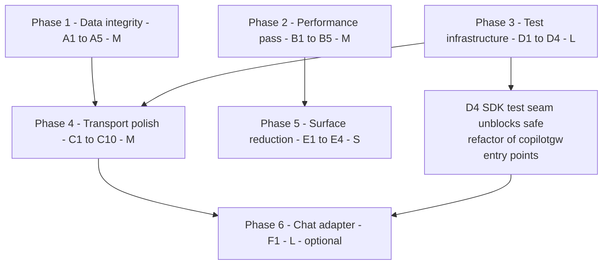
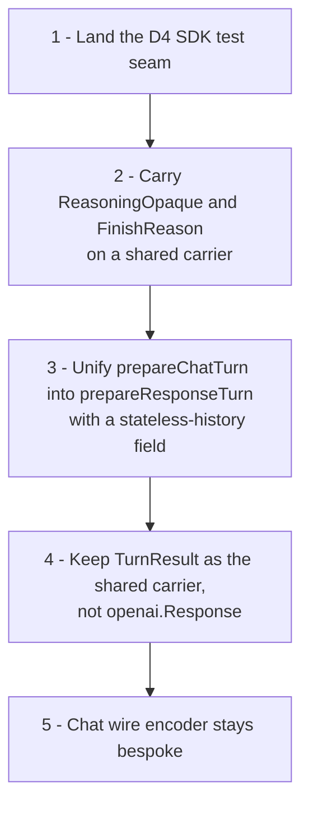

# Remaining Work Plan

Resolution plan for issues identified in the code review that were **not** addressed by the
24 commits on `evlouie/code-review-fixes` (`002cfc9..f33fbd4`).

Every item below was re-verified against the tree at `f33fbd4` — file and line references are
current, not carried over from the original review.

**Scope reminder:** backwards compatibility with this proxy's own past behaviour is explicitly a
non-goal. Matching the real OpenAI API and the target functionality is the only compatibility
constraint that matters.

---

## Contents

- [Prioritisation framework](#prioritisation-framework)
- [Sequencing](#sequencing)
- [Workstream A — Correctness & data integrity](#workstream-a--correctness--data-integrity)
- [Workstream B — Hot-path performance](#workstream-b--hot-path-performance)
- [Workstream C — Transport & protocol polish](#workstream-c--transport--protocol-polish)
- [Workstream D — Test & release engineering](#workstream-d--test--release-engineering)
- [Workstream E — Surface reduction](#workstream-e--surface-reduction)
- [Workstream F — Deferred structural work](#workstream-f--deferred-structural-work)
- [Definition of done](#definition-of-done)

---

## Prioritisation framework

Items are ranked by a single question: **what does the user lose if this is never fixed?**

| Class | Meaning | Response |
| --- | --- | --- |
| **Silent wrong data** | The client receives or stores something incorrect with no error | Fix first, always |
| **Cross-request contamination** | One request can affect another | Fix first, always |
| **Resource growth** | Unbounded goroutines, memory, or disk under normal use | Fix in the same cycle |
| **Wasted work** | Correct, but pays a cost proportional to load | Batch into one perf pass |
| **Ergonomics** | Correct and cheap, but confusing or awkward | Opportunistic |

> [!NOTE]
> Nothing remaining is in the P0 "wedges or kills the process" class — those were all resolved
> (`f8a810b`, `aec20e6`, `c79793d`, `4a2a32a`). The highest remaining severity is **silent wrong
> data**, concentrated in [A1](#a1--reasoning-emission-policy-is-written-into-durable-records) and
> [A2](#a2--model-controlled-tool-call-ids-are-a-process-global-key).

### Effort sizing

Sizes describe **scope and blast radius**, not duration — they are deliberately not calendar
estimates, since the right pace depends on who picks the work up.

| Size | Meaning |
| --- | --- |
| **XS** | One-line or one-expression change. No new test needed beyond an assertion |
| **S** | Single function or file. Localised, one focused regression test |
| **M** | Several files within one package, or a change that crosses one package boundary. Needs a small test group and a deliberate look at neighbouring invariants |
| **L** | Crosses multiple packages, or changes a shared type/interface. Needs new test infrastructure and a staged rollout across commits |

A phase's size is the size of its largest item, not the sum — phases are batches of independent
work, so they parallelise.

---

## Sequencing

Phases are ordered by dependency, not just priority. Phase 1 and Phase 2 are independent and can
run in parallel by different people; Phase 4 has a hard prerequisite on Phase 3.



| Phase | Theme | Effort | Risk | Can ship independently |
| --- | --- | --- | --- | --- |
| 1 | Data integrity | M | Medium | Yes |
| 2 | Performance | M | Low | Yes |
| 3 | Test infrastructure | L | Low | Yes |
| 4 | Transport polish | M | Low | Yes |
| 5 | Surface reduction | S | Low | Yes |
| 6 | Chat adapter | L | **High** | No — needs 3 and 4 |

---

## Workstream A — Correctness & data integrity

### A1 — Reasoning-emission policy is written into durable records

**Where:** `internal/httpapi/responses.go:188` → `internal/copilotgw/types.go:186` →
`internal/copilotgw/turn_runner.go:1155` → persisted at `internal/copilotgw/responses.go:137`

`SuppressReasoning` is derived from the `COPILOT_REASONING_EMISSION` **presentation** knob, then
threaded into the gateway and consulted inside `responseFromTurn`:

```go
if !p.suppressReasoning {
    if item, ok := reasoningOutputItem(turn); ok {
        resp.Output = append(resp.Output, item)
    }
}
```

`responseForTurn(params, turn)` returns that object and `recordFromResponse` persists **the same
object**. So running with `COPILOT_REASONING_EMISSION=off` permanently strips reasoning from stored
records; flipping the knob back does not restore it for existing responses.

> [!WARNING]
> Commit `f6dcb69` ("build each response once") made this **worse**, not better. Previously two
> objects were built and only one was persisted; now there is a single filtered object flowing to
> both the wire and the store. This is a genuine regression introduced by an otherwise-correct
> refactor, and it is the strongest argument for fixing A1 before any further response-pipeline work.

**Fix:** make suppression purely an edge concern. The gateway should always build the complete
response including reasoning; `internal/httpapi` already has `filterResponseReasoning`
(`responses_stream.go:408`) and should be the only place it is applied. Delete
`suppressReasoning` from `responseParams` and `ResponseRequest`, and apply the filter to
`GET /v1/responses/{id}` responses too so read-back is consistent.

**Verify:** a test that persists a turn with emission `off`, flips the config to `both`, and asserts
`GET` returns the reasoning. Effort **S** · Risk **Low**.

---

### A2 — Model-controlled tool-call IDs are a process-global key

**Where:** `internal/toolproxy/toolproxy.go:623`

```go
openaiID := sdkID
if openaiID == "" {
    openaiID = "call_" + uuid.NewString()
}
```

`sdkID` is `copilot.AssistantMessageToolRequest.ToolCallID` — produced by the **upstream model**, not
by this proxy. It becomes the key in the process-global `Broker.byCall` map. Backends behind Copilot
vary; several non-OpenAI models emit low-entropy or sequential IDs (`call_1`, `tool_0`).

Two concurrent requests that both produce `call_1` collide: the second `Register` silently steals the
mapping, and `FindByCallIDs` can return **another client's batch**. Best case an arity error; worst
case (same arity) client A's tool result is delivered into client B's conversation.

> [!CAUTION]
> This is the only remaining **cross-request contamination** path. It is low-probability but the
> failure mode is a confidentiality violation, not a crash.

**Fix:** always mint a proxy-owned `"call_" + uuid.NewString()`. Keep the SDK id only in
`Call.SDKID` for the reverse mapping back into the SDK. Commit `c79793d` already unexported
`Batch.calls`, so the blast radius is contained to this file.

**Verify:** a test registering two batches whose SDK ids collide, asserting each resolves to its own
batch. Effort **S** · Risk **Low** — but read `CompleteToolOutputsWithSetup` first, since the client
echoes these ids back and the reverse lookup must still work.

---

### A3 — Warm sessions escape gateway shutdown accounting

**Where:** `internal/copilotgw/real.go:84-88`, `internal/copilotgw/warm_response.go`

```go
active := g.active.closeAndSnapshot()
pending := g.pending.drain()
```

`activeRunnerRegistry`'s doc comment claims it tracks "every runner… so gateway shutdown can abort
and await all SDK activity". A `WarmResponseSession` has no runner — it is owned entirely by
`internal/httpapi`'s per-connection state. The gateway has **zero visibility** into an SDK session it
created, so `Stop()` neither aborts nor awaits it.

Related, from the original review and still open: a warm session's buffered input lives only in
`WarmResponseSession.input`. On the normal resume path only the *current* request's prompt is sent,
so a warmed input is silently lost across a dropped WebSocket or a restart.

**Fix:** register warm sessions in a gateway-owned registry with the same lifecycle contract as
runners. Then decide the input question explicitly — either consume `record.InputText` on resume, or
document that warm input is best-effort and does not survive a disconnect.

Effort **M** · Risk **Medium** (touches the WebSocket connection lifecycle).

---

### A4 — Partial `usage` objects violate the required-integer contract

**Where:** `internal/openai/models.go:36`, `:47`; producer `internal/copilotgw/turn_runner.go`
(`usageFromSDK`)

```go
PromptTokens     *int64 `json:"prompt_tokens,omitempty"`
InputTokens      *int64 `json:"input_tokens,omitempty"`
```

`usageFromSDK` emits a non-nil `*Usage` when *either* input or output tokens are present, so the wire
can carry `{"usage":{"completion_tokens":12,"total_tokens":12}}` — a usage object missing the
required `prompt_tokens`. `input_tokens_details` is never populated at all.

Impact: Codex CLI deserialises `response.completed` usage into non-optional integers (a missing key
is a serde failure that aborts the turn); cost middleware doing `prompt_tokens + completion_tokens`
gets a null-arithmetic error.[^usage]

**Fix:** make the counters plain `int64` without `omitempty` and emit the object all-or-nothing —
`NewResponseUsage` already returns `nil` when all three are nil (`models.go`), so apply that gate
per-object rather than per-field. Always populate both details structs (zeroed) when the parent is
emitted. Keep `*Usage`/`*ResponseUsage` at the parent so absence stays expressible.

> [!IMPORTANT]
> This changes the persisted record format. `internal/sessionstore/record_golden_test.go` pins those
> bytes and **will** fail — that is the golden test doing its job. Update the literals deliberately
> and call the format change out in the commit message, exactly as `3a4fd40` did.

Effort **S** · Risk **Low**.

---

### A5 — `ParseModelSelector` splits on the last colon unconditionally

**Where:** `internal/openai/model_selector.go:21`

```go
separator := strings.LastIndex(raw, ":")
```

Any model id containing a colon is silently truncated. `model: "openrouter/mistral-7b:free"` becomes
model `openrouter/mistral-7b` with effort `free`, and the client gets a confusing "model not found"
for a name it never sent. The suffix is also never validated against the known effort set, so
`gpt-5:banana` is forwarded verbatim to the SDK.

**Fix:** only treat the suffix as a reasoning effort when it matches a known effort token; otherwise
leave the model id intact. Separately validate `reasoning_effort` / `reasoning.effort` against the
allowed set and return a 400 naming the right `param`.

Effort **S** · Risk **Low**.

---

## Workstream B — Hot-path performance

> [!TIP]
> Land B1–B5 as one "performance pass" commit series with benchmarks committed **first**, so the
> improvement is measured rather than asserted. `internal/httpapi` already has benchmark files to
> follow as a pattern; `internal/copilotgw` has none, which is why these regressions went unnoticed.

### B1 — Model catalog deep-cloned on every lookup

**Where:** `internal/copilotgw/models.go:50,61,79,97,105`; `internal/copilotgw/images.go:439,462`

`findModel` calls `refreshModels`, which on a **cache hit** runs `cloneModels(cache.models)` while
holding `cache.mu`, then linear-scans for one id. `cloneModels` deep-copies every model including a
recursive clone of each nested `Metadata` map.

`findModel` runs at least twice per request (`ValidateModel`, `requestReasoningEffort`) and once more
*per message containing images*. With a ~40–60 model catalog that is thousands of allocations per
request to answer "does model X exist", serialised behind the cache mutex.

**Fix:** add `lookupModel(id) (Model, bool)` that takes the lock, finds the single entry, and clones
only that one. Build a `map[string]int` index at refresh time to drop the linear scan. Keep
`cloneModels` for `ListModels`, which genuinely needs the whole set.

Effort **S** · Risk **Low** · Expected: ~2 allocations per lookup instead of ~n×metadata.

### B2 — `len([]rune(...))` evaluated unconditionally as debug-log arguments

**Where:** 4 sites in `internal/copilotgw/*.go`

Go evaluates arguments before the call, so the level check inside `debug` buys nothing. `[]rune(s)`
allocates `4×len(s)` bytes that are immediately discarded — ~800 KB per 200 KB response, three times
per turn, **at `info` level**.

**Fix:** replace with `utf8.RuneCountInString` (zero-alloc) and gate the expensive call sites behind
the `debugEnabled` flag the loop already computes.

Effort **S** · Risk **None**.

### B3 — `SaveResponse` read-modify-writes the full record

**Where:** `internal/sessionstore/store.go:358`

Every save first `ReadFile`s and unmarshals the previous record to test one boolean and read
`previousSession`, then marshals and writes the new one — under `s.mu`, with two fsyncs. With a
32 MiB turn cap that is a 32 MiB read plus parse on the request hot path per turn.

**Fix:** the tombstone check does not need the body. Keep an in-memory tombstone set (`deletedIDs`
already exists) or write tombstones as a zero-byte marker testable with one `stat`. For
`previousSession`, note the retention link index added in `20ecf77` can answer this from a directory
listing.

Effort **M** · Risk **Medium** — interacts with the tombstone and retention-link invariants from
`20ecf77`/`7bf1749`. Re-run those regression tests deliberately.

### B4 — `Batch.expireHooks` grows unbounded within a turn

**Where:** `internal/toolproxy/toolproxy.go:67`, `:586`, `:596`, `:686`

`Broker.Register` appends a removal hook **every** call, and `Register` is invoked once per
`CaptureRequests` *and once per `handleInvocation`*. An N-tool parallel turn accumulates N+2
identical `Remove` closures, each doing an O(|calls|) map walk at expiry — quadratic in tool-call
count for a long agent loop.

**Fix:** register the removal hook exactly once (a `sync.Once` or a `registered bool` on `Batch`), or
replace the slice with a single `onExpire func(*Batch)` set at construction.

Effort **S** · Risk **Low**.

### B5 — `schemaMap` round-trips JSON Schema without `UseNumber`

**Where:** `internal/toolproxy/toolproxy.go:358-364`

```go
params := map[string]any{}
if err := json.Unmarshal(raw, &params); err != nil {
```

Every JSON number in a client's tool schema becomes a `float64` and is re-marshalled by the SDK.
`{"maximum": 1e21}` re-encodes as `1e+21`; `{"enum":[9007199254740993]}` becomes `…992`. The model
then sees a schema the client did not write.

The codebase already knows the fix — `CanonicalRawJSON` in `internal/toolcatalog` explicitly calls
`dec.UseNumber()` for exactly this reason. The two paths are simply inconsistent.

**Fix:** use `json.NewDecoder(bytes.NewReader(raw))` + `UseNumber()`. Also reject non-object
`parameters` with a proper `apierr.InvalidRequest` rather than letting a raw Go unmarshal error
(`"json: cannot unmarshal bool into Go value of type map[string]interface {}"`) reach the client.

Effort **S** · Risk **Low** — this is really a correctness fix wearing a performance hat.

---

## Workstream C — Transport & protocol polish

Individually small; batch them. Ordered by user impact.

| ID | Issue | Where | Fix | Effort |
| --- | --- | --- | --- | --- |
| **C1** | `requestContext` returns a **no-op** `CancelFunc` when `RequestTimeout <= 0` (the default). Harmless on SSE (net/http cancels on return) but on WebSocket the parent is `connCtx`, so every early return leaks a producer goroutine and its 32-slot channel until the client disconnects | `internal/httpapi/middleware.go:46-51` | Always return a real `context.WithCancel` so `cancel()` is meaningful on every transport | S |
| **C2** | `closeWith` blocks on the WebSocket close handshake (up to ~10 s) **before** cancelling `connCtx`, and `closeOnce.Do` serialises other callers behind it. Shutdown takes ~10 s per connection against a 20 s budget | `internal/httpapi/responses_ws.go:202-205` | Swap the order: `cancel()` first, then `conn.Close(...)`. Cancellation is what stops upstream work; the handshake is best-effort cleanup | S |
| **C3** | WebSocket writer uses `context.Background()`, so a write to a black-holed client holds the writer mutex for the full 30 s even though `connCtx` died seconds earlier | `internal/httpapi/responses_ws.go:38,49` | Thread `connCtx` in and derive the deadline from it | S |
| **C4** | `404`/`405` return Go's plain-text defaults, not OpenAI JSON envelopes. Clients that unconditionally `.json()` an error body throw a parse error — common when someone hits `/v1/embeddings` | `internal/httpapi/server.go` (no custom handler) | Wrap the mux to convert non-JSON 404/405 into `apierr` envelopes | S |
| **C5** | Response ids are read from `r.URL.Path` (**decoded**) while `ServeMux` routes on `EscapedPath()`, so `%2E%2E` reaches the gateway. Neutralised downstream by `safeName`, but the transport is relying on an invariant it does not own — and it rejects legitimately encoded ids | `internal/httpapi/responses.go:221,234` | Register `GET/DELETE /v1/responses/{id}` and use `r.PathValue("id")`, validated against the real id grammar | S |
| **C6** | No 429 in the error taxonomy; upstream throttling degrades to 502 `server_error`. The official SDKs implement backoff keyed on 429 + `Retry-After` and will retry a 502 on a generic schedule instead | `internal/apierr/apierr.go` (no `KindRateLimit`) | Add the kind + a `RetryAfter` field; emit the header in `WriteError`. GitHub Copilot rate-limits aggressively, so this has real operational value | S |
| **C7** | No SSE keep-alive. A reasoning-heavy turn can go minutes without a byte; ALB (60 s) and Cloudflare (100 s) idle timeouts will drop it[^proxy] | `internal/openai` SSE writer, now in `httpapi` | Periodic `: keep-alive\n\n` comment frame; also gives dead-peer detection | S |
| **C8** | Streaming failures are never logged and record as `200 OK`, because headers were committed before the failure. An upstream 502 storm is indistinguishable from healthy traffic | `internal/httpapi/responses.go`, `chat.go` | Log the terminal stream outcome; consider surfacing it in `requestLogMetadata` so the access line reflects it | S |
| **C9** | `getResponse`/`deleteResponse` pass `r.Context()` straight through, ignoring `RequestTimeout` unlike every other handler | `internal/httpapi/responses.go` | Wrap with `requestContext` for consistency (depends on C1) | XS |
| **C10** | `logprobs: true` is a hard 400 while `include: ["message.output_text.logprobs"]` is accept-and-ignore. Under the policy established in `9ea5821`/`cc28306` both are "missing optional data" and should behave the same | `internal/openai/validation.go` | Relax `logprobs` to accept-and-ignore, matching `include` | XS |

> [!NOTE]
> C1 and C2 are the only two with a resource-leak or shutdown-latency consequence. If the batch has
> to be split, take those first.

---

## Workstream D — Test & release engineering

### D1 — Flaky wall-clock test

**Where:** `cmd/copilot-api/main_test.go:53-60`

```go
go runRetentionLoop(ctx, store, slog.Default(), time.Millisecond)
deadline := time.Now().Add(100 * time.Millisecond)
for time.Now().Before(deadline) { ... }
```

A 100 ms budget for a goroutine to be scheduled, tick, stat the filesystem, and delete a file — with
`t.Fatal` on miss. This will fail intermittently on a loaded CI runner.

**Fix:** give the retention loop a completion signal (a channel or an injected hook) and block on it
with a multi-second timeout. `internal/httpapi/hardening_test.go` already demonstrates the right
pattern — `newFailureLogSampler` takes `now` as a parameter, making its window test fully
deterministic. Effort **S**.

### D2 — No goroutine-leak detection

The service's central risk is leaked SDK sessions and parked tool-call handlers — exactly what leak
detection catches. There are 18 `go func(` sites across the test files and nothing verifies they
drain.

**Fix:** add `go.uber.org/goleak` with `TestMain` + `goleak.VerifyTestMain` in `internal/httpapi` and
`internal/copilotgw`, ignoring known background loops. Effort **S** · high value given
`f8a810b`/`aec20e6` were both leak-adjacent.

### D3 — No `t.Parallel()` anywhere

Zero occurrences across ~16k lines of tests, so `-race` observes very little real concurrency and the
green race runs are weaker evidence than they look.

**Fix:** opt in package by package, starting with the pure-function packages (`openai`,
`toolcatalog`, `hydration`). Do **not** parallelise tests that mutate process env
(`cmd/copilot-api/main_test.go`, `internal/config`). Effort **M**.

### D4 — The gateway↔SDK seam is structurally untestable

**Where:** 17 hand-written fake gateways in `internal/httpapi` stub at the *gateway* interface

Consequence, measured at review time: `internal/httpapi` scored 77% while every entry point in
`internal/copilotgw/chat.go` scored **0%**. `Chat`, `StreamChat`, `CreateResponse`, `WarmResponse`,
`prepareChatTurn`, `prepareResponseTurn` had no test executing them. The fakes are also frequently
tautological — returning a hardcoded `"ok"` and asserting `"ok"` appears in the body.

Additionally, every fake embeds a **nil** `copilotgw.Gateway`, so a new interface method surfaces as a
nil-deref inside `net/http` rather than a clear failure.

> [!IMPORTANT]
> D4 is the highest-leverage item in this entire document. It is a prerequisite for
> [F1](#f1--chat-completions-as-an-adapter-over-responses) and it is why the P0 concurrency bugs in
> `turn_runner.go` survived to production review. Commits `aec20e6` and `f6dcb69` had to hand-roll
> one-off harnesses because no seam existed.

**Fix:** introduce a fake at the **SDK** boundary — a stub `copilot.Session`/client that `NewReal`
can be constructed against — so the real gateway code executes under test. Keep the handler-level
fakes for HTTP contract tests but stop treating them as gateway coverage. Replace the embedded nil
interface with a base struct whose methods `panic("unexpected call to X")` so misroutes name
themselves.

Effort **L** · Risk **Low** (test-only) · Unblocks Phase 6.

---

## Workstream E — Surface reduction

| ID | Issue | Where | Resolution |
| --- | --- | --- | --- |
| **E1** | `COPILOT_API_CACHE_DIR` is **inert**. Nothing outside `config`/`sessionstore` reads `CacheDir`; the model cache is purely in-memory and the embedded CLI installs under `XDG_CACHE_HOME` (see the Docker fixes in `aadc115`). It still costs a root claim, a marker write with two fsyncs, a per-cycle retention scan, and purge participation. The README describes it inaccurately | `internal/config/config.go`, `internal/sessionstore` | **Delete it** — the knob, the managed root, and the README row. Alternatively point the SDK's CLI install at it so it means something; deleting is simpler and `aadc115` already documented the real cache location |
| **E2** | `COPILOT_STRICT_COMPAT` is a debugging aid promoted to production config. It toggles three call sites and, since `9ea5821`/`cc28306` established a coherent permissive policy, strict mode's remaining value is unclear | `internal/openai/validation.go` | Decide deliberately: either delete it and keep permissive, or document precisely who strict mode is for. Do not leave it undecided |
| **E3** | Tool `strict` and `defer_loading` are captured, cloned, persisted — and **never read**. A client sending `strict: true` is told the request succeeded but arguments are not schema-constrained | `internal/toolcatalog/catalog.go:60-61,180-186` | Either enforce `strict` locally (validate the model's arguments against the declared schema before delivering the call) or reject it with a clear 400 so the client can fall back. Silent acceptance is the one option the policy from `cc28306` rules out |
| **E4** | `AppendFile` has no fsync — the one remaining write path with no durability guarantee after `a6c9867` made `WriteFile` atomic | `internal/sessionfs/provider.go` | Decide whether session-state appends need durability. If yes, fsync; if no, document why |

> [!TIP]
> E1 and E2 together remove 2 of 24 environment variables and a whole managed storage root. The
> original review judged the config surface to be roughly 2× larger than justified for a single-user
> loopback proxy — this is the cheapest progress against that.

---

## Workstream F — Deferred structural work

### F1 — Chat Completions as an adapter over Responses

Attempted in `6e9d3ce`/`ed2d02c`/`f33fbd4` and **deliberately stopped**. The independently valuable
parts shipped (hydration replay for Responses cold-continuation, unified terminal-text
reconciliation, unified stream sink). The adapter itself was blocked by five concrete findings:

1. **`ReasoningOpaque` has no field on `openai.Response`.** Chat's
   `reasoning_details[0].signature` + `format:"anthropic-claude-v1"` come from `TurnResult`.
   Deriving `ChatCompletion` from a `Response` silently drops both.
2. **`finish_reason` is not derivable.** `responseFromTurn` hardcodes `Status: "completed"`;
   `TurnResult.FinishReason` is the only carrier of `stop`/`tool_calls`.
3. **Reasoning identity diverges.** `reasoning_details[].id` is the SDK reasoning id; the Response
   reasoning item's `ID` is the `rs_` output-item id that `f6dcb69` made canonical. Different things
   by design.
4. **Usage mapping is one-way.** `NewResponseUsage` returns nil when all counts are nil and adds
   `input_tokens_details.cached_tokens`, which has no Chat home.
5. **The compatibility-contract tests are written against the Chat types.** Deleting `ChatRequest`,
   `ChatContinuationRequest`, and `StreamEvent` forces edits to `server_test.go` (10 refs),
   `reasoning_test.go` (7), and `hardening_test.go` (6) — the exact files whose assertions *are* the
   contract.

> [!CAUTION]
> Do not attempt F1 until D4 exists. Without an SDK-level test seam the only regression signal is the
> wire-byte assertions in those three files, and the refactor requires editing them — removing the
> safety net and the thing it protects in the same change.

**Recommended path if pursued:**



The variant most likely to succeed keeps `TurnResult` — not `openai.Response` — as the shared
carrier, which sidesteps blockers 1–4 entirely. Blocker 5 remains and is the reason D4 must come
first. Note the prior attempt judged the merged `prepareResponseTurn` would need a persistence
opt-out, a batch-kind parameter, a `retained`-path flavour, and a wire-visible error-`param` prefix
(`"messages"` vs `"input"`) — a parameterised union rather than a simplification. **Re-evaluate
whether the dedup is worth it** before committing to Phase 6; the honest answer may be no.

Effort **L** · Risk **High** · Value **Medium**.

---

## Definition of done

Every commit in this plan must satisfy the gates already enforced by
[`.github/workflows/ci.yml`](../.github/workflows/ci.yml) and reproducible locally via `make ci`:

- [ ] `gofmt -l .` — empty
- [ ] `go build ./...`
- [ ] `go vet ./...`
- [ ] `go test ./... -race -count=1`
- [ ] `staticcheck@v0.7.0 ./...` — zero findings
- [ ] `deno fmt --check`, `deno check tests/ai-sdk-deno`, `deno task test:ai-sdk`

Additional standards carried forward from the review cycle, which repeatedly caught real defects:

1. **Demonstrate the bug before fixing it.** Write the regression test first, run it against the
   parent commit, and record the observed failure in the commit body. This is how the `os.Root`
   symlink escape (5/5 runs), the toolproxy map race (10/10 plus a reproduced `fatal error`), and the
   retention data loss were each confirmed to be real rather than theoretical.
2. **Treat golden-test failures as findings, not chores.** `internal/sessionstore/record_golden_test.go`
   and `internal/openai/responses_output_item_test.go` pin wire and on-disk formats. A1 and A4 will
   break them legitimately; anything else breaking them is a bug.
3. **Verify external facts.** Action pins, image digests, SDK capabilities, and stdlib API shapes were
   all asserted incorrectly at least once during the review cycle — in both directions. Check them.

[^usage]: OpenAI Responses API — `usage.input_tokens`, `output_tokens`, and `total_tokens` are
    required integers on the usage object, with `input_tokens_details` and `output_tokens_details`
    always present. <https://developers.openai.com/api/reference/resources/responses>

[^proxy]: AWS Application Load Balancer defaults to a 60-second idle timeout and Cloudflare to
    100 seconds; both terminate connections with no bytes in flight regardless of the origin's own
    timeouts. <https://docs.aws.amazon.com/elasticloadbalancing/latest/application/application-load-balancers.html#connection-idle-timeout>
