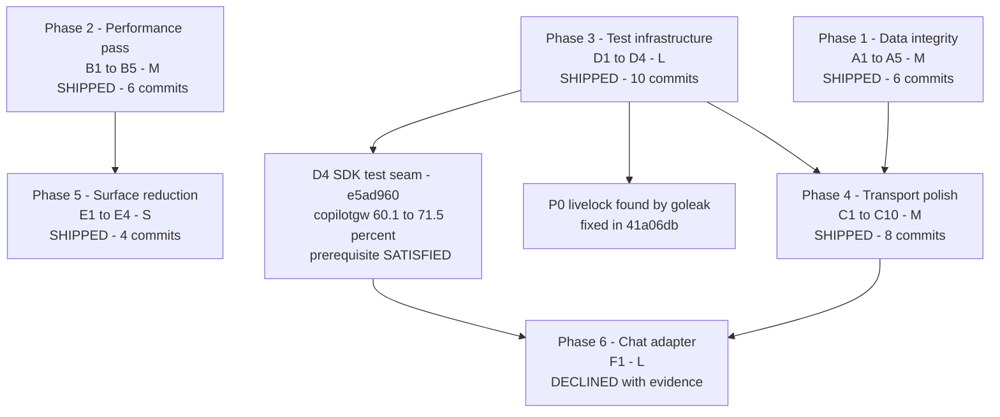
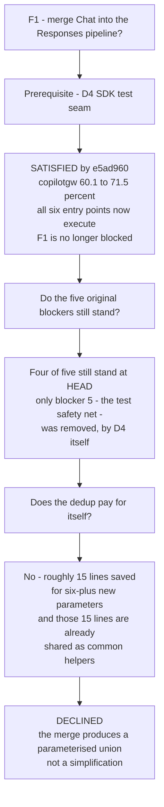

# Review Follow-Up: Completion Record

This document began life as a forward-looking resolution plan for the 24
findings that survived the first round of code-review fixes
(`002cfc9..f33fbd4`). Those findings have since been executed: **35 commits on
`evlouie/code-review-fixes` (`e9520e2..0fc27a8`)** closed Workstreams A, B, C, D
and E in full. Workstream F was re-evaluated and **declined**, which the plan
itself explicitly invited.

It is now a **completion record**: each item maps to the commit that resolved
it, the measured evidence that resolution produced, and — where the plan was
wrong — the correction the executing work forced. What genuinely remains is
collected in one place, in [Residual backlog](#residual-backlog).

**Scope reminder, unchanged:** backwards compatibility with this proxy's own
past behaviour is explicitly a non-goal. Matching the real OpenAI API and the
target functionality is the only compatibility constraint that matters.

---

## Contents

- [The headline outcome](#the-headline-outcome)
- [Three corrections to the plan](#three-corrections-to-the-plan)
- [Prioritisation framework](#prioritisation-framework)
- [Sequencing — what shipped](#sequencing--what-shipped)
- [Workstream A — Correctness & data integrity](#workstream-a--correctness--data-integrity)
- [Workstream B — Hot-path performance](#workstream-b--hot-path-performance)
- [Workstream C — Transport & protocol polish](#workstream-c--transport--protocol-polish)
- [Workstream D — Test & release engineering](#workstream-d--test--release-engineering)
- [Workstream E — Surface reduction](#workstream-e--surface-reduction)
- [Workstream F — the decision](#workstream-f--the-decision)
- [Round two — adversarial review](#round-two--adversarial-review)
- [Round three — the live suite](#round-three--the-live-suite)
- [Residual backlog](#residual-backlog)
- [Definition of done](#definition-of-done)

---

## The headline outcome

The plan opened by claiming nothing remaining was in the P0 "wedges or kills the
process" class. That claim was wrong, and the work that disproved it is the
single most valuable thing this cycle produced.

> [!CAUTION]
> **D2 found a real P0 livelock, fixed in `41a06db`.** A Responses WebSocket
> client that vanished _without_ a close handshake — a dropped network, a killed
> client, anything yielding a RST rather than a close frame — left the
> connection's handler goroutine spinning at full speed **for the life of the
> process**.
>
> `wsjson.Read` failed, but with none of the errors the loop treated as
> terminal: `coder/websocket` had already closed the connection, so the error
> was `net.ErrClosed` rather than a `CloseError`, and `connCtx` was still live
> because nothing had torn the connection down. `net/http` does not cancel a
> hijacked request's context either. The loop wrote an error frame (which also
> failed instantly) and read again, forever.
>
> The handler never returned, so it never reached `state.close`/`state.wait`:
> the connection's **warm SDK session stayed connected and its `sessionstore`
> retention pins stayed held**, on top of burning a core per dead client. A
> single `-count=1` run of `internal/httpapi` left **three** of these behind,
> all at the same site, still present after 55 s of retries.

This is the ordinary case, not an exotic one. Clients die without saying goodbye
all the time.

> [!IMPORTANT]
> This vindicates the plan's own claim that D4/D2 were the highest-leverage
> items in the document. Adding `go.uber.org/goleak` to one package found, in
> **one test run**, a process-lifetime bug that had survived a full manual code
> review and the entire prior fix cycle. Leak detection is not a hygiene chore;
> it is the only tool here that observes what the code does after the assertions
> pass.

---

## Three corrections to the plan

Three items were prescribed wrongly. The executing work caught each, and each is
recorded here as a correction rather than quietly dropped, because in every case
the plan's version was plausible and would have been implemented as written.

### B2 — the premise was false

> [!WARNING]
> The plan claimed `len([]rune(s))` allocates `4×len(s)` bytes that are
> immediately discarded — "~800 KB per 200 KB response". **It does not.** The Go
> compiler rewrites `len([]rune(s))` into a rune count, and the two spellings
> measure identically:
>
> ```
> BenchmarkRuneSliceLen-10        138471 ns/op   1685.00 MB/s   0 B/op   0 allocs/op
> BenchmarkRuneCountInString-10   138252 ns/op   1687.67 MB/s   0 B/op   0 allocs/op
> ```
>
> There was no hidden 800 KB. The real cost, which `8451210` removed, was an
> unconditional **O(n) rune scan** of every final assistant message, reasoning
> block and turn text, plus **854 B / 5 allocs of `[]any` attribute slices per
> turn event, at `info` level** — because Go evaluates arguments before the
> call, so the level check inside `r.debug` bought nothing. Gating the three
> sites behind the `debugEnabled` flag the loop already computes: **139061 ns/op
> → 0.32 ns/op, 854 B → 0 B, 5 allocs → 0 allocs** with debug off.
> `utf8.RuneCountInString` was kept as the clearer spelling, not as the fix.

### C2 — the prescribed fix was unsafe

> [!WARNING]
> The plan said: _"Swap the order: `cancel()` first, then `conn.Close(...)`."_
> With `coder/websocket` v1.8.15 that severs the TCP connection and races the
> close frame, because the library installs a `context.AfterFunc` on the read
> context that calls `Conn.close`.[^wsclose]
>
> **Measured:** the naive swap turned `TestServerShutdownClosesActiveWebSockets`
> from a graceful `StatusGoingAway` close into an **abnormal closure 4 times out
> of 10**.
>
> `0747461` split the two roles instead. `connCtx` is the **work** context and
> is cancelled first; the read loop reads with the connection's **parent**
> context and is woken by `conn.Close`, with `connCtx.Err()` telling it that a
> failed read is our own teardown rather than a client fault. The graceful close
> frame is preserved and a new test pins it. (That teardown surfaces as
> `net.ErrClosed` — the same error class as the P0 livelock above, which is not
> a coincidence.)

### C6 — the prescribed error shape was wrong

> [!WARNING]
> The plan implied `"type": "rate_limit_error"`. **That is Anthropic's
> vocabulary and appears nowhere in OpenAI's.** OpenAI puts the exhausted
> _dimension_ in `type` — `"requests"` or `"tokens"` — and
> `"rate_limit_exceeded"` in `code`.[^ratelimit] The Copilot SDK throttles
> requests rather than a token budget, so `8f824a0` emits `type: "requests"`,
> and `internal/httpapi/errors.go` carries a comment saying why so it cannot
> drift back.

---

## Prioritisation framework

Retained because the [Residual backlog](#residual-backlog) is sized with it.
Items were ranked by a single question: **what does the user lose if this is
never fixed?**

| Class                           | Meaning                                                         | Response                 |
| ------------------------------- | --------------------------------------------------------------- | ------------------------ |
| **Silent wrong data**           | The client receives or stores something incorrect with no error | Fix first, always        |
| **Cross-request contamination** | One request can affect another                                  | Fix first, always        |
| **Resource growth**             | Unbounded goroutines, memory, or disk under normal use          | Fix in the same cycle    |
| **Wasted work**                 | Correct, but pays a cost proportional to load                   | Batch into one perf pass |
| **Ergonomics**                  | Correct and cheap, but confusing or awkward                     | Opportunistic            |

### Effort sizing

Sizes describe **scope and blast radius**, not duration — they are deliberately
not calendar estimates, since the right pace depends on who picks the work up.

| Size   | Meaning                                                                                                                                                    |
| ------ | ---------------------------------------------------------------------------------------------------------------------------------------------------------- |
| **XS** | One-line or one-expression change. No new test needed beyond an assertion                                                                                  |
| **S**  | Single function or file. Localised, one focused regression test                                                                                            |
| **M**  | Several files within one package, or a change that crosses one package boundary. Needs a small test group and a deliberate look at neighbouring invariants |
| **L**  | Crosses multiple packages, or changes a shared type/interface. Needs new test infrastructure and a staged rollout across commits                           |

---

## Sequencing — what shipped

Phases 1–5 all shipped. Phase 6's hard prerequisite (the D4 SDK seam) shipped
too, which is what made a real decision on Phase 6 possible rather than a
deferral.



| Phase | Theme               | Effort | Commits | Outcome                                                        |
| ----- | ------------------- | ------ | ------- | -------------------------------------------------------------- |
| 1     | Data integrity      | M      | 6       | Shipped                                                        |
| 2     | Performance         | M      | 6       | Shipped, every fix measured                                    |
| 3     | Test infrastructure | L      | 10      | Shipped; found the P0 livelock                                 |
| 4     | Transport polish    | M      | 8       | Shipped; C2 and C6 corrected                                   |
| 5     | Surface reduction   | S      | 4       | Shipped; 2 env vars deleted, 2 behaviours added                |
| 6     | Chat adapter        | L      | 0       | **Declined** — see [Workstream F](#workstream-f--the-decision) |

---

## Workstream A — Correctness & data integrity

| ID     | Commit(s)            | Outcome                                                                                                                                                                                                                                                                                                                                                                                    |
| ------ | -------------------- | ------------------------------------------------------------------------------------------------------------------------------------------------------------------------------------------------------------------------------------------------------------------------------------------------------------------------------------------------------------------------------------------ |
| **A1** | `99f760a`            | Suppression is now purely an edge concern. `responseParams.suppressReasoning` and `ResponseRequest.SuppressReasoning` are deleted; the gateway always builds the complete response. `internal/httpapi` resolves the policy once per request and applies `filterResponseReasoning` at the single stream funnel, and `GET /v1/responses/{id}` filters the stored record **on read**.         |
| **A2** | `7842784`            | `ensureCall` always mints `"call_" + uuid.NewString()`. The model's id is kept on `Call.SDKID` and indexed in a new **per-batch** `Batch.bySDKID`, so colliding model ids can no longer reach across requests in either direction.                                                                                                                                                         |
| **A3** | `0eb98d1`, `bec6806` | `warmSessionRegistry` sits alongside `active`/`pending` with the same close-then-drain contract; `use` and `Disconnect` both deregister. Register-after-close is **rejected**, not absorbed, so a shutdown is visible on the wire rather than hidden behind a `WarmResponseResult` whose session is dead. The warm-input question was then decided explicitly rather than documented away. |
| **A4** | `6c2d1c3`            | Counters became plain `int64` with no `omitempty` on both `Usage` and `ResponseUsage`; the Responses details objects became non-pointer values. Optionality moved up one level and stays there. `usageFromSDK` returns `nil` unless the SDK reported at least one token count, and otherwise fills all three.                                                                              |
| **A5** | `4e5076f`, `680ed71` | A trailing `:suffix` is a reasoning effort **only** when it names a canonical effort; anything else stays on the model id. The canonical enum moved to `internal/openai/reasoning_effort.go` as the single ordered set and `copilotgw` dropped its duplicate rank table and normalizer. Explicit `reasoning_effort` and `reasoning.effort` are now validated against it.                   |

**A1's regression was real, and the plan's diagnosis of it was right.** The test
failed against the parent commit with the stored record having lost its
reasoning item entirely — `f6dcb69` had made a single filtered object flow to
both the wire and the store, exactly as the plan's `[!WARNING]` predicted.

**A2's consequence was demonstrated, not asserted.** Against the pre-fix tree,
both concurrent requests published `tool_call_id: "call_1"`; with that first
assertion relaxed so the consequence was visible, request A's `tool_call_id`
resolved to **request B's batch**.

**A3's second half was a judgement call, made deliberately.** `bec6806` chose to
consume the persisted input on resume rather than document the loss: losing
input a client was told was accepted is a correctness bug, not a best-effort
optimisation, and the data was already on disk. The crux is that "delivered" and
"buffered" input cannot be inferred apart, so a durable
`ResponseRecord.InputPending` marker was added (default `false` = already
delivered, so v0–2 records migrate into v3 unchanged). It is replayed on exactly
one path: the branch where the previous record's own SDK session resumed
successfully. Two limits are documented at `pendingInputPrompt` — only text
survives, and the flag is not cleared once consumed.

> [!NOTE]
> A4 and `bec6806` both changed the persisted record format, and the golden
> tests failed as designed. A4's `goldenResponseRecordJSON` was byte-for-byte
> unchanged because its record already sets every usage member; a new
> `goldenSparseUsageRecordJSON` was added to pin the sparse case the
> fully-populated golden could never catch on its own. That is the golden doing
> its job in both directions.

A5's cost is stated on the function: a model-specific effort outside the enum
can no longer be spelled as a suffix. That is the intended trade — an
unrecognised token is now a name, not a control. A hypothetical real model named
`foo:low` would be unreachable, and the resolution order is documented rather
than left ambiguous.

---

## Workstream B — Hot-path performance

Benchmarks landed **first**, in `98d1ab0`, so every fix below is reported as a
measured delta against a committed baseline rather than an assertion.
`internal/copilotgw`, `internal/sessionstore` and `internal/toolproxy` had no
benchmark files at all, which is why these regressions went unnoticed.

All figures: darwin/arm64 (Apple M1 Max), `-benchmem`, median of 6.

| ID     | Commit    | Measured outcome                                                                                                                                                                                                                                                                                 |
| ------ | --------- | ------------------------------------------------------------------------------------------------------------------------------------------------------------------------------------------------------------------------------------------------------------------------------------------------ |
| **B1** | `a14b4cf` | `FindModelCacheHit` **78873 → 1665 ns/op**, 1201 → 25 allocs (135170 → 2688 B/op). `ModelLookupsPerRequest` 235063 → 5119 ns/op, **405 KB → 8 KB** per image-carrying request. `ListModels` is ~4% slower (it now takes `cache.mu` twice) and allocates exactly as before.                       |
| **B2** | `8451210` | **139061 ns/op → 0.32 ns/op**, 854 B → 0 B, 5 → 0 allocs with debug off. See [the correction](#b2--the-premise-was-false).                                                                                                                                                                       |
| **B3** | `14f760b` | Large-record save (4 MiB) **37.0 → 17.5 ms**, 2913 → 563 allocs, **23.6 MB → 11.3 MB** per save. Small-record save unchanged in time (it is fsync-bound) and allocates 42% fewer bytes but 62 more objects — a streamed token decode makes more small allocations when there is nothing to skip. |
| **B4** | `b41389c` | Closing a 128-tool turn **691474 → 485085 ns/op** (~30% cheaper), 1583 → 1317 allocs, **705362 → 405062 B/op**. `BenchmarkBrokerRegisterRepeat` 870 → 766 ns/op, 2 → 1 allocs.                                                                                                                   |
| **B5** | `594a07b` | Correctness, not speed. `{"enum":[9007199254740993]}` was silently re-encoding as `…992` and `{"maximum":1e21}` as `1e+21`. Now decoded with `UseNumber`, matching `toolcatalog.CanonicalRawJSON`, which had always done this.                                                                   |

B1's whole risk is keeping the id index consistent with `cache.models`, so that
was made structural: `setModelsLocked` assigns both fields in one critical
section and is the only writer of either.
`TestModelIndexStaysConsistentAcrossRefreshPaths` drives every path that can
replace the catalog and fails loudly when the rebuild is weakened.

B3 rejected both alternatives the plan suggested, with reasons:
`Store.deletedIDs` is not a tombstone set (it is only populated while a pin is
held, so it cannot answer for a record deleted before this process started), and
deriving `previousSession` from the `.links` index means a `ReadDir` plus a
`Stat` per session on every save — trading a bounded cost for one that grows
with the store. Reading four header fields answers both exactly. Two deliberate
divergences are documented at the call site (a record with a corrupt tail is now
healed rather than stranded; duplicate object names resolve first-wins).

B5 also fixed a leaked internal error: `schemaMap(true)` used to hand the client
`"json: cannot unmarshal bool into Go value of type map[string]interface {}"`,
unclassified. It now returns `apierr.InvalidRequest` naming the offending tool
and the `tools` request field.

> [!NOTE]
> B4 is only partly closed. Growth is still superlinear because `Register`
> republishes the batch's whole call-id set on each of its N+1 calls — a
> **separate** O(N²) term, in `Register` itself rather than in expiry. See
> [Residual backlog](#residual-backlog).

---

## Workstream C — Transport & protocol polish

| ID      | Commit(s) | Outcome                                                                                                                                                                                                                                                                                                                                                        |
| ------- | --------- | -------------------------------------------------------------------------------------------------------------------------------------------------------------------------------------------------------------------------------------------------------------------------------------------------------------------------------------------------------------- |
| **C1**  | `a7453b0` | `requestContext` always derives with `context.WithCancel`. A `CancelFunc` whose meaning depends on which transport called it is not a usable contract. Pre-fix, every early return in `handleWebSocketResponseCreate` stranded a gateway goroutine blocked on a send nobody would read.                                                                        |
| **C2**  | `0747461` | **Corrected** — see [above](#c2--the-prescribed-fix-was-unsafe). Roles split rather than order swapped.                                                                                                                                                                                                                                                        |
| **C3**  | `0747461` | `connCtx` threaded into `webSocketJSONWriter`; the write context is now a 30 s child of `connCtx`, so it is bounded by both. Pre-fix a frame to a black-holed peer held the writer mutex for the full 30 s even when the connection had been cancelled seconds earlier.                                                                                        |
| **C4**  | `dcf7dde` | The mux is wrapped in a `ResponseWriter` that converts a 404/405 into the standard envelope via `writeErrorObject`. It only rewrites a response whose `Content-Type` is not already JSON — the exact discriminator between `net/http`'s routing defaults and a handler's deliberate 404. Both bodies match the real API rather than being invented.[^errshape] |
| **C5**  | `9cd3820` | `GET`/`DELETE /v1/responses/{id}` registered as a wildcard, read via `r.PathValue("id")`, validated against `openai.ValidResponseID`. Pre-fix, `GET /v1/responses/%2E%2E` returned 404 having handed the gateway an id of `".."`. A malformed id is now a **400** naming param `response_id`, which is what the real API returns.                              |
| **C6**  | `8f824a0` | **Corrected** — see [above](#c6--the-prescribed-error-shape-was-wrong). `KindRateLimit` → 429 with a transport-neutral `RetryAfter`; `KindUnavailable` → 503, used for `WarmResponse`'s "gateway is shutting down", which had been a 502.                                                                                                                      |
| **C7**  | `c1dc663` | `: keep-alive` comment frames on an idle SSE stream, `COPILOT_SSE_KEEP_ALIVE_INTERVAL` default 15 s.[^proxy] The ticker runs at half the interval and only writes when the stream is actually idle, so a busy stream carries no keep-alives and the worst-case gap is one and a half intervals.                                                                |
| **C8**  | `80160aa` | `stream_outcome` on the access line, with three values: `completed`, `failed`, `abandoned`. The HTTP status stays 200 (it is correctly 200 once committed) but the record's **severity** now follows the outcome, so a failed stream is an ERROR line and an abandoned one a WARN.                                                                             |
| **C9**  | `a7453b0` | Folded into C1: `getResponse`/`deleteResponse` now bound their store reads with `COPILOT_REQUEST_TIMEOUT` like every other handler.                                                                                                                                                                                                                            |
| **C10** | `1929ee1` | `logprobs`/`top_logprobs` relaxed to accept-and-ignore, matching `include: ["message.output_text.logprobs"]` on the other surface. `logprobs: false` keeps its allow predicate — it asks for nothing.                                                                                                                                                          |

C7 required a real concurrency change, not just a ticker: two writers now share
one `http.ResponseWriter`, so `SSEWriter` grew a mutex and every frame goes
through a single `writeFrame` that takes it, or two writers would interleave
halves of two frames into one unparseable event. The `stop` func returned by
`KeepAlive` waits for the goroutine before returning, which is what makes
`defer stop()` safe against `requestLoggingMiddleware` reading the byte counter
the instant the handler returns.

C8's Chat path needed different handling from Responses: Chat has no single
terminal point (its write-error returns are scattered through the event loop),
so it defaults to `abandoned` on entry and the two terminal paths overwrite it.
The panic path works out because the metadata is last-write-wins.

> [!NOTE]
> C10 was superseded within the same cycle. It moved `logprobs`/`top_logprobs`
> into the strict-only rejection table; `846871a` (E2) then deleted strict mode
> entirely, so both fields are now simply never rejected, and
> `RequestedLogprobs` drives the unhonoured-control debug line. The end state is
> the one C10 wanted, reached by a shorter path.

C6 has an honest gap, recorded in its own commit body: no pre-fix failing
assertion exists and none could, because the taxonomy had no way to spell "429"
— an assertion about a 429 does not compile against the parent. The concrete
pre-fix observation was that `rg StatusTooManyRequests internal/` found nothing.

---

## Workstream D — Test & release engineering

### D1 — Flaky wall-clock tests · `54abe94`

Three tests gated a `t.Fatal` on a short wall-clock budget. Two were made
genuinely deterministic:

- `TestRetentionLoopPrunesIdleExpiredState` — `runRetentionLoop` took an
  `onSweep` hook (nil in production, mirroring the existing `modelsFetcher`
  seam), so the test blocks on a prune the loop reports as finished and then
  asserts on what that prune did.
- `TestRefreshModelsDeduplicatesConcurrentForcedRefreshes` — moved into a
  `testing/synctest` bubble, where `synctest.Wait` returns only once every other
  goroutine is durably blocked, which is exactly the precondition the assertion
  needs.

> [!NOTE]
> The third was **not** made deterministic, and the commit says so.
> `TestResponsesWebSocketKeepsLongResponseAliveWhileGenerating` had its idle
> budget widened from 30 ms to **250 ms**, which is _wider_, not deterministic —
> its idle timeout doubles as the budget for accepting the socket and scheduling
> the read loop. The watchdog's actual rules are pinned deterministically
> instead, in `internal/httpapi/responses_ws_idle_test.go`, which drives
> `watchResponsesWebSocketIdle` under a `testing/synctest` fake clock with no
> socket involved.

### D2 — Goroutine-leak detection · `fc5e272`, `41a06db`

`go.uber.org/goleak` with a `TestMain` in the four packages whose goroutines own
an SDK session, a parked tool handler, or a retention pin that only that
goroutine releases: `internal/httpapi`, `internal/copilotgw`,
`internal/toolproxy`, `internal/sessionstore`. Only **two** ignores were needed,
both in `internal/httpapi` and both for `net/http`'s own client-side connection
pool; each carries a comment naming the loop and why it is not ours. The other
three verify with no ignores at all.

Eight further packages were probed and are clean but deliberately not wired up:
they start no long-lived goroutines, so the check would be inert there.

The payoff was immediate and is described in
[The headline outcome](#the-headline-outcome).

### D3 — `t.Parallel()` · `fb09b70`, `a330ad0`, `fd6aecf`, `62fe47a`, `650c8d1`

Rolled out package by package in five commits, riskiest last, each independently
revertible. The point was never wall-clock: it is that `-race` now observes
these packages actually running concurrently, so hidden shared state shows up as
a race rather than as an ordering coincidence. Verified with `-race -count=8`
(`-count=10` for `copilotgw`).

Every exception is sequential **with a comment saying why**:

| Package                              | Sequential exception                                                                                                                                                                                 |
| ------------------------------------ | ---------------------------------------------------------------------------------------------------------------------------------------------------------------------------------------------------- |
| `cmd/copilot-api`, `internal/config` | Not parallelised at all — they mutate the process environment via `t.Setenv`                                                                                                                         |
| `internal/copilotgw`                 | `TestResolvePromptFetchesRemoteImage`, `TestWarmResolvedImageIsReusedWithoutRefetch` swap the package-level `imageHTTPClient`                                                                        |
| `internal/httpapi`                   | `TestWebSocketReadLoopEndsWhenTheClientVanishesWithoutAClose` (uses `goleak.IgnoreCurrent`); `TestResponsesWebSocketKeepsLongResponseAliveWhileGenerating` (CPU contention is what used to break it) |
| `internal/sessionstore`              | The hand-written-shapes table in `TestSaveResponseHeaderAgreesWithTheFullRecord`                                                                                                                     |

That last one is the exercise finding exactly the hazard it exists to find:
those subtests all write and read the same `"z"` record path, and parallelising
them made them read each other's bytes.

`a330ad0` also widened three `toolproxy` wall-clock waits from 1 s to 5 s, since
running the suite concurrently makes a 1 s budget tighter for no benefit.
Nothing about what they assert changed.

### D4 — The gateway↔SDK seam · `9b0749e`, `e5ad960`

`9b0749e` replaced the embedded **nil** `copilotgw.Gateway` in all 17
hand-written fakes with `unimplementedGateway`, whose methods panic naming
themselves. A test drives a misroute through the real mux and asserts the
recovered panic log identifies `Gateway.CreateResponse`. No fake needed a new
override, which confirms none of them were silently reaching an unimplemented
method.

`e5ad960` did the substantive half, as a **type-level extraction only** — no
control flow changed:

- `copilotSession` — the four things the gateway does with an SDK session (`ID`,
  `Send`, `Abort`, `Disconnect`). The id is a method because `*copilot.Session`
  already has a `SessionID` field.
- `sdkSessionOpener` plus a `RealGateway.sessionOpener` field, nil in
  production, mirroring the existing `modelsFetcher` seam.
- `wrapSDKSession` keeps "no session and no error" a nil interface, so existing
  `session == nil` guards keep working.

The tests then run the **real** `RealGateway` — real model cache, prompt
resolution, session filesystem, tool broker, turn runner and `sessionstore` —
with only the runtime replaced.

`internal/copilotgw` coverage **60.1% → 71.5%**:

| Entry point           | Before | After |
| --------------------- | ------ | ----- |
| `prepareChatTurn`     | 0.0%   | 73.7% |
| `Chat`                | 0.0%   | 89.5% |
| `StreamChat`          | 0.0%   | 77.3% |
| `prepareResponseTurn` | 0.0%   | 73.3% |
| `CreateResponse`      | 0.0%   | 76.9% |
| `WarmResponse`        | 0.0%   | 58.6% |
| `StreamResponse`      | 39.2%  | 66.7% |

---

## Workstream E — Surface reduction

| ID     | Commit    | Resolution                                                                                                                                                                                                                                                                                                                                                                                                 |
| ------ | --------- | ---------------------------------------------------------------------------------------------------------------------------------------------------------------------------------------------------------------------------------------------------------------------------------------------------------------------------------------------------------------------------------------------------------- |
| **E1** | `9105ba7` | **Deleted.** `COPILOT_API_CACHE_DIR` had no producer: every hit of `rg -n 'CacheDir\|CACHE_DIR' --type go` was plumbing or a test of that plumbing. It cost a managed-root claim, a marker write with two fsyncs, a per-cycle retention scan over an always-empty directory, and a purge target — to guarantee an empty directory stays empty. **BREAKING.**                                               |
| **E2** | `846871a` | **Deleted.** `COPILOT_STRICT_COMPAT` reached three call sites, and every one of its additions was a _rejection_ of an item the permissive policy had already classified as safe to ignore. Its stated purpose (debugging client conformance) is already served by the debug-level unhonoured-control logs, without breaking the client. **BREAKING.**                                                      |
| **E3** | `0fc27a8` | **Enforced locally.** Tool `strict` now compiles the client's declared parameters at request time and validates the model's arguments against them, at _both_ materialisation points (`CaptureRequests` and `handleInvocation`, because their ordering is not guaranteed). `defer_loading` is **forwarded**, not rejected: `true` → `ToolDeferAuto`, `false` → `ToolDeferNever`, absent → runtime decides. |
| **E4** | `7b2f085` | **Fsynced.** `AppendFile` was the last write path in `sessionfs` with no durability guarantee. The parent directory is synced only when the append created the name, so the extra barrier is paid once per file rather than once per append.                                                                                                                                                               |

E2 did not leave the decision open, which the plan explicitly demanded. The
answer is that permissive is the only policy: every mainstream OpenAI client
sends `temperature` or `user` by default, so strict mode 400'd essentially every
real client, all-or-nothing, with no per-field granularity.

E3's choice between "enforce" and "400" was settled by evidence rather than
taste. `TestHTTPAcceptsValidOpenAIClientRequests` already pins a Chat request
carrying `{"strict":true}` at 200, and says why: these are calls a widely-used
client emits by default. Real OpenAI accepts `strict` and honours it, so a 400
could not be justified against real OpenAI behaviour. Two consequences are
deliberate: a strict tool whose schema will not compile is a 400 **at request
time** (a guarantee that was never enforceable should fail before tokens are
spent), and `strict` on a freeform custom tool is a 400 (there is nothing
client-declared to constrain).

E4's reasoning is worth keeping, because "a lost append costs nothing" was the
tempting answer and it is wrong. A Responses continuation first tries
`resumeSession` on the SDK session id named by the previous record, and only
rehydrates from the session store when that resume fails. A silently short event
log therefore means the resume **succeeds** and the model answers without the
turn whose id the client just passed as `previous_response_id` — silent context
loss, not a visible fallback.

> [!NOTE]
> **Verified config surface: 24 → 23 documented variables** in `README.md`'s
> Configuration table (including `GITHUB_TOKEN`). E1 and E2 removed two; C7
> added `COPILOT_SSE_KEEP_ALIVE_INTERVAL`. The managed storage root went away
> with E1, which is the larger structural win: `prune` and `purge` no longer
> touch anything under `.cache`, and the Dockerfile, compose file and README now
> say so plainly.

---

## Workstream F — the decision

### F1 — Chat Completions as an adapter over Responses: **declined**

The plan said: _"Re-evaluate whether the dedup is worth it before committing to
Phase 6; the honest answer may be no."_ It was re-evaluated against HEAD. **The
answer is no.**

This is recorded as a decision with evidence, not a deferral.



#### The prerequisite is satisfied — F1 is not blocked, it is not worth it

`e5ad960` introduced the SDK-boundary seam (`copilotSession` +
`sdkSessionOpener`) the plan named as F1's hard prerequisite, and with it all
six previously-0% gateway entry points now execute under test. Blocker 5 of the
original five — "the compatibility-contract tests are written against the Chat
types, so the refactor removes the safety net and the thing it protects in the
same change" — is therefore gone. The `[!CAUTION]` the plan attached to F1 no
longer applies.

Everything below is a judgement about value, not about safety.

#### Four of the five original blockers still stand, verified against HEAD

1. **`ReasoningOpaque` still has no field on `openai.Response`.** It lives on
   `copilotgw.TurnResult` (`internal/copilotgw/types.go:108`) and is consumed
   only by `internal/httpapi/chat.go:299`, which builds `reasoning_details` from
   it. Deriving a `ChatCompletion` from a `Response` still drops it.
2. **`finish_reason` is still not derivable from a `Response`.**
   `responseFromTurn` hardcodes `Status: "completed"`
   (`internal/copilotgw/turn_runner.go:1153`), and `FinishReason` exists only on
   the Chat type (`internal/openai/chat.go:175`) and its `TurnResult` carrier
   (`types.go:114`).
3. **Reasoning identity still diverges by design.**
   `TurnResult.reasoningOutputItemID()` (`turn_runner.go:1277`) mints the `rs_`
   output-item id, while `reasoning_details[].id` is the SDK reasoning id.
   Different things, deliberately.
4. **Usage mapping is still one-way.** `NewResponseUsage` adds
   `input_tokens_details.cached_tokens` (`internal/openai/models.go:92`), which
   has no Chat home. `6c2d1c3` changed usage substantially, but it did not make
   the mapping bidirectional — it made both sides complete, which is a different
   property.

#### The dedup itself does not pay

Measured at HEAD:

- `prepareChatTurn` is **53 lines** (`internal/copilotgw/chat.go:28-80`) and is
  **always stateless**. It mints a fresh `chat_` session per request, hydrates
  full history into session events, and never consults a previous record, a warm
  session, or a tool catalog.
- `prepareResponseTurn` is **125 lines**
  (`internal/copilotgw/response_session.go:28-152`), built around exactly those
  three branches.

Merging them needs, at minimum: a `stateless` flag, a catalog-vs-raw-tools
branch, a persistence opt-out, a batch-kind parameter, a `retained`-path
flavour, and a wire-visible error-`param` prefix (`"messages"` vs `"input"`).
That is six-plus parameters to save roughly 15 lines.

And those 15 lines are **already shared**. `requestReasoningEffort`,
`resolvePromptWithImageBudget`, `newSessionEventSink` and `resumeSession` are
common helpers today — the duplication the plan wanted to remove has already
been factored out by every other means. What is left in each function is the
part that genuinely differs.

> [!IMPORTANT]
> The merge would produce a **parameterised union, not a simplification** —
> precisely what the plan suspected when it wrote the caveat. Declining is the
> plan's own recommendation followed, not overridden.

The independently valuable parts of the original attempt
(`6e9d3ce`/`ed2d02c`/`f33fbd4`) had already shipped and remain: hydration replay
for Responses cold-continuation, unified terminal-text reconciliation, and the
unified stream sink.

---

## Round two — adversarial review

After the workstreams landed, three sub-agents reviewed the result adversarially
with disjoint scopes — concurrency and lifecycle, wire-protocol conformance, and
data integrity. They were told that "looks good" was a failed review. Between
them they found **fourteen** defects in the work above, four of them serious
enough to have shipped real breakage, and two of the fixes they proposed were
themselves wrong.

> [!CAUTION]
> Two of the highest-severity findings were **regressions introduced by the
> fixes in this very document**, not pre-existing bugs. `0747461` (C2) fixed one
> abnormal-close race and reintroduced the same race one layer over, through the
> frame writer it had just bound to `connCtx`. `bec6806` (A3) fixed one
> warm-input loss and left two more on adjacent paths. A fix landing green is
> not evidence that it is correct.

### What was found and fixed

| Finding                                                                                                                                                            | Severity | Fix       |
| ------------------------------------------------------------------------------------------------------------------------------------------------------------------ | -------- | --------- |
| Close handshake severed by the write-timeout `AfterFunc` — the C2 fix reintroduced the race it avoided, measured **15/20 runs failing, 28/160 shutdowns abnormal** | High     | `b18e0ca` |
| A request reaching `newTurnRunner` after `Stop()` hung **forever** and leaked its goroutine; `0eb98d1`'s own reasoning about the registry ordering was wrong       | High     | `8a6a582` |
| Chained warm requests silently dropped the earlier input; `InputPending` was never cleared, so an ordinary retry double-sent it                                    | High     | `5ff87ec` |
| A truncated record decoded as a _complete_ header — `json.Decoder.More` swallows the read error — resurrecting deleted responses and stranding retention links     | High     | `78eec33` |
| Warm session installable into already-closed WebSocket state                                                                                                       | Medium   | `a47c536` |
| `state.finish()` raced the next `response.create`, so a correct client got a spurious "only one response.create may be active" — **4/10 runs**                     | Medium   | `5c902fe` |
| `cached_tokens` hardcoded to 0 though the SDK reports it, and `cache_write_tokens` missing though the schema requires it                                           | Medium   | `4e36ce0` |
| Legacy usage records served with a `total_tokens` contradicting their own addends                                                                                  | Medium   | `4e36ce0` |
| The terminal Chat usage chunk could carry `"usage": null`                                                                                                          | Medium   | `4e36ce0` |
| Strict tool schemas this proxy merely cannot _compile_ were 400s — Draft-07 spellings and any external `$ref`, both accepted by real OpenAI                        | Medium   | `cd51cc7` |
| Strict-argument violations reached the client as an unclassified 502/500 with the tool name gone                                                                   | Medium   | `cd51cc7` |
| Rate-limit classification never ran on SDK call sites — the most likely throttle point still returned 502                                                          | Medium   | `93e3239` |
| `metadata` accepted and silently discarded, though the real API echoes it                                                                                          | Medium   | `10b9195` |
| `GET /v1/models` published `model:effort` aliases that `POST` then answered with 404                                                                               | Medium   | `10b9195` |
| Accept-and-ignore was unobservable for ~12 fields; `AppendFile` could skip its directory sync; `bindBroker` inherited rather than enforced its invariant           | Low      | `08ea85d` |

### Two proposed fixes that were wrong

Both were rejected on measurement rather than argument, which is the same
standard that caught the three plan errors in the previous round.

- **`UseNumber` for strict arguments.** The review proposed decoding tool
  arguments with `UseNumber` to match `schemaMap`. Measured against
  `jsonschema-go` v0.4.3, that breaks **every numeric strict tool**: the library
  reflects over the instance and types a `json.Number` as `"string"`, so
  `{"n":5}` against `{"type":"integer"}` reports
  `5 has type "string", want "integer"`. Both the schema's literals and the
  instance already round through `float64` and therefore compare correctly. Not
  changed; the reason is now recorded at the call site so it is not re-proposed.
- **`quota` → keep 502.** The previous round argued retrying cannot clear a
  billing block. That argument inverts itself: the official SDKs retry 5xx on
  their generic schedule, so 502 produced _more_ automatic retries than the 429
  it was avoiding. Now 429 `insufficient_quota`, matching the real API. This
  reversed the round-one decision and **deleted** its backlog entry; the `R6`
  slot below has since been reused for an unrelated item.

### The one that justifies the exercise

`goleak` (D2) found a **P0 livelock** that a full manual review had missed. A
WebSocket client vanishing without a close handshake — a dropped network or a
killed client, i.e. the ordinary case — left the handler goroutine spinning at
full speed for the life of the process, because `wsjson.Read` returned
`net.ErrClosed`, which none of the loop's terminal conditions matched, while
`connCtx` was still live. The handler never returned, so the connection's warm
SDK session was never disconnected and its retention pins were never released.
One `-count=1` run left three behind.

---

## Round three — the live suite

Everything above was verified against unit tests and fakes. The Deno AI SDK
suite — the only gate that pairs the **real** Vercel AI SDK parser with **real**
Copilot upstream — is `ignore`d unless `COPILOT_API_AI_SDK_DENO_TESTS=1`, so CI
had only ever run the one test asserting the suite is disabled. Running it
against a live subscription reported **19 passed, 3 failed**.

All three failed identically on `002cfc9`, so none was a regression from this
work. The test file is byte-identical between the two, which made the comparison
exact. They split two ways.

> [!CAUTION]
> **One was a real defect: the Responses WebSocket error frame omitted
> `sequence_number`, fixed in `825e3dc`.** Every schema an OpenAI client matches
> an `error` stream event with requires that field. Against `@ai-sdk/openai`
> 4.0.20, whose chunk union is
> `[nested-error, flat-error, {type: string}.loose()]`, both error branches fail
> without it, the frame matches the catch-all, and the stream transform maps it
> to `unknown_chunk` and **drops it**.
>
> Observed live: a client sending an unknown `previous_response_id` over the
> WebSocket transport saw a clean, empty, _successful_ stream. The same request
> over REST correctly returned `400 previous_response_not_found` — the proxy's
> logic was right and only the frame's shape was wrong, which is precisely the
> class of bug no amount of Go-side testing was going to find.

The frame now carries the error **both flat and nested**, because OpenAI's own
clients disagree about where to look and this proxy has to satisfy both:
openai-dotnet reads `code`/`message`/`param` at the top level per the published
`ResponseErrorEvent`,[^errorevent] while the live service emits
`{"error": {...}}` — confirmed by an OpenAI maintainer as the service failing to
honour its own contract[^dotnet881] — and openai-python's streaming reads
`error.message` and works only against that nested shape.[^python2487]

### The other two were the tests being wrong

The two reasoning-effort cases asserted that a reasoning-capable model _emits_
reasoning. That is not this proxy's contract and not a property a model owes
anyone.

> [!WARNING]
> Measured against `claude-sonnet-5` at `effort=low`, the prompt they sent —
> _"reply with one concise sentence about why 19 \* 37 = 703"_ — produced **zero
> reasoning items and zero reasoning tokens on 3 of 3 runs**. The same model, at
> the same effort, with _"What is 17\*24? Think it through."_ produced a
> reasoning item every time. The proxy was forwarding the effort correctly and
> faithfully reporting that the model chose not to think.

`28f392d` rewrote them to assert the property the proxy _is_ answerable for:
that whatever reasoning its own response carries is consumable by a real OpenAI
client. A recording `fetch` captures the exact bytes returned for the very turn
the SDK parsed, so ground truth and surface come from one response rather than
two nondeterministic calls. Three claims are checked separately because they are
not equally strong — text on the wire must reach the client (the sharp one), a
textless item must survive as a reasoning part, and reported reasoning tokens
must reach `usage` (weakest, since the SDK reads the same field). If upstream
emitted nothing, the assertion is skipped rather than failed.

> [!TIP]
> **The rewrite was verified by fault injection, not by passing.** With the
> proxy patched to write reasoning text under `"summary_text"` instead of
> `"text"` — still on the wire, just under a key the SDK's parser does not read
> — both tests fail. An earlier draft of the same check passed under that fault
> and was discarded; "the assertion is green" and "the assertion can fail" are
> different claims, and only the second one is worth anything.

That round also fixed a latent bug in the old assertion: it read
`usage.reasoningTokens`, but the AI SDK nests it under
`usage.outputTokenDetails.reasoningTokens`, so that fallback was always `0`.

Live suite after this round: **22 passed, 0 failed.**

---

## Residual backlog

What genuinely remains after both rounds. Nothing here is a correctness or
contamination bug; the highest class present is **wasted work**, plus several
deliberate scope limits. R6–R9 were added by round two and are documented limits
rather than open defects.

| ID     | Item                                                                                                                                                                                                                                                                                                                                                                                                                                                                                                                                                                       | Class       | Effort |
| ------ | -------------------------------------------------------------------------------------------------------------------------------------------------------------------------------------------------------------------------------------------------------------------------------------------------------------------------------------------------------------------------------------------------------------------------------------------------------------------------------------------------------------------------------------------------------------------------- | ----------- | ------ |
| **R1** | `Broker.Register` (`internal/toolproxy/toolproxy.go:174-198`) still republishes the batch's **whole** call-id set on each of its N+1 calls — a residual O(N²) term, separate from the expiry-hook one `b41389c` fixed. A tracked "already published" set was implemented, measured and **reverted**: it removed only the map inserts, not the dominant O(N) iteration, and _cost_ allocations at small N (1720 → 1992 B/op at `tools=1`) for under 4% at `tools=128`. Fixing it properly needs `ensureCall` to hand `Register` the ids it created, which is an API change. | Wasted work | **M**  |
| **R2** | `prepareResponseTurn` retries `resumeSession` once **per instruction candidate**. `openai.InstructionCandidates("")` yields two (`" "` and a fallback system prompt), and `resumeSession` loops over them (`internal/copilotgw/sessions.go:92-107`), so a single refused resume issues two SDK calls before falling back — doubling cold-continuation latency for requests with no instructions.                                                                                                                                                                           | Wasted work | **S**  |
| **R3** | E3 does **not** enforce OpenAI's strict _schema subset_ (`additionalProperties: false`, every property listed in `required`).[^strict] Real OpenAI 400s a strict schema that violates it; this proxy validates arguments against whatever schema the client declared. A client whose schema is strict-shaped gets the same guarantee either way; one whose schema is not gets a weaker guarantee than OpenAI would give, silently.                                                                                                                                         | Ergonomics  | **S**  |
| **R4** | E3 added **no retry loop** for strict violations. A non-conforming tool call fails the turn with an error naming the tool rather than being fed back to the model for correction. This is stated as deliberate in `0fc27a8` — this proxy does not own the model's decoding loop — but it is a real behavioural gap against OpenAI's constrained decoding, which cannot emit a non-conforming call at all.                                                                                                                                                                  | Ergonomics  | **M**  |
| **R5** | `apierr.RateLimited`'s `RetryAfter` is plumbed, mapped to an RFC 9110 `Retry-After` header and tested end to end, but is **unreachable in production**: the Copilot SDK exposes no retry-after on `SessionErrorData`, so `0` is passed and the header is never emitted today. The field exists so the taxonomy can carry a wait the moment anything can supply one.                                                                                                                                                                                                        | Ergonomics  | **XS** |
| **R6** | `classifyUpstreamError` classifies SDK-call failures by **string match** on the rendered error. The SDK returns `*internal/jsonrpc2.Error`, an unexported type, so `err.Error()` — `"JSON-RPC Error %d: %s"` — is the only signal available; nothing can read its `Code` or `Data`. A false positive costs a client an unnecessary backoff. Revisit if the SDK ever exports its error type.                                                                                                                                                                                | Ergonomics  | **S**  |
| **R7** | An unencoded `..` in a response-id path is swallowed by `ServeMux`'s `cleanPath` **before** any handler runs, so `GET /v1/responses/..` returns a `307` with an HTML body — outside the JSON envelope `dcf7dde` guarantees. Encoded traversal (`%2E%2E`) is correctly rejected with a 400. Left alone deliberately: intercepting redirects to rewrite them risks breaking legitimate ones, for a path no client sends on purpose.                                                                                                                                          | Ergonomics  | **S**  |
| **R8** | Warm-input delivery is **at-least-once**, not exactly-once. The pending claim is retired only after `Send` returns, so a crash between that return and the store write replays input the conversation already has. Clearing first would turn every failed send into silently dropped input the client was told had been accepted — a repeated turn is recoverable, a lost one is not. On the streaming path the claim writes are issued from the send goroutine, widening the window from "a crash" to "another request resumed the same warm id within milliseconds".     | Ergonomics  | **M**  |
| **R9** | Strict tool schemas this proxy cannot compile are accepted and **not enforced**, logged at warn. That is the graceful degradation — a 400 would break integrations over schemas real OpenAI accepts — but it does mean `strict: true` is not a guarantee on those tools.                                                                                                                                                                                                                                                                                                   | Ergonomics  | **S**  |
| **F1** | Chat Completions as an adapter over Responses. **Declined** with evidence — see [Workstream F](#workstream-f--the-decision). Recorded here so it is not silently re-proposed; re-open only if a _new_ reason appears, not because the prerequisite now exists.                                                                                                                                                                                                                                                                                                             | —           | **L**  |

> [!TIP]
> R1 and R2 remain the only two with a load-proportional cost, and R2 is by far
> the cheaper: it is one conditional on whether instructions were actually
> empty. Take it first if this list is picked up. R8 is the only entry that can
> still surprise a user, and only across a crash.

---

## Definition of done

Every commit in this record satisfied the gates enforced by
[`.github/workflows/ci.yml`](../.github/workflows/ci.yml) and reproducible
locally via `make ci`:

- [x] `gofmt -l .` — empty
- [x] `go build ./...`
- [x] `go vet ./...`
- [x] `go test ./... -race -count=1`
- [x] `staticcheck@v0.7.0 ./...` — zero findings
- [x] `deno fmt --check`, `deno check tests/ai-sdk-deno`,
      `deno task test:ai-sdk`

The Deno suite is gated off by default, so that last line proves only that the
suite is disabled. It was additionally run **against a live Copilot
subscription** — 22 passed, 0 failed — which is what round three above records.
Nothing else here has ever exercised real upstream.

Three standards were carried forward from the review cycle. All three earned
their place again:

1. **Demonstrate the bug before fixing it.** The regression test was written
   first, run against the parent commit, and the observed failure recorded in
   the commit body. Every A- and C-item body above carries one. Where this was
   _impossible_ — C6, because an assertion about a 429 does not compile against
   a taxonomy with no 429 — the commit says so and supplies the next-best
   concrete observation instead of pretending.
2. **Treat golden-test failures as findings, not chores.** A4 and `bec6806` both
   broke `internal/sessionstore/record_golden_test.go` legitimately and both
   said so in the commit message. A4 additionally added
   `goldenSparseUsageRecordJSON`, because the fully-populated golden was
   structurally incapable of catching the sparse case.
3. **Verify external facts.** This paid for itself three times over. The
   `len([]rune(...))` premise (B2), the WebSocket close ordering (C2) and the
   429 envelope shape (C6) were each asserted incorrectly in the plan and each
   corrected only because they were checked against a benchmark, a ten-run
   measurement, and the upstream issue trail respectively. The 404/405 bodies in
   C4 and the `defer_loading` semantics in E3 were likewise taken from primary
   sources rather than invented.

[^usage]: OpenAI Responses API — `usage.input_tokens`, `output_tokens`, and
    `total_tokens` are required integers on the usage object, with
    `input_tokens_details` and `output_tokens_details` always present.
    <https://developers.openai.com/api/reference/resources/responses>

[^proxy]: AWS Application Load Balancer defaults to a 60-second idle timeout and
    Cloudflare to 100 seconds; both terminate connections with no bytes in
    flight regardless of the origin's own timeouts.
    <https://docs.aws.amazon.com/elasticloadbalancing/latest/application/application-load-balancers.html#connection-idle-timeout>

[^wsclose]: `coder/websocket` v1.8.15 installs a `context.AfterFunc` on the read
    context in `setupReadTimeout` which calls `Conn.close`, so cancelling the
    context the read loop reads with severs the connection rather than merely
    interrupting the read. <https://github.com/coder/websocket>

[^ratelimit]: OpenAI's 429 envelope uses `code: "rate_limit_exceeded"` with
    `type` naming the exhausted dimension (`"requests"` or `"tokens"`), per the
    openai-node maintainer in <https://github.com/openai/openai-node/issues/168>
    and reproduced in <https://github.com/openai/openai-python/issues/2703>.
    `"rate_limit_error"` is Anthropic's vocabulary.

[^errshape]: The 404 wording (`Invalid URL (POST /v1/embeddings)`) is reported
    identically across <https://github.com/openai/openai-node/issues/132> and
    <https://github.com/openai/openai-python/issues/250>; the 405 wording
    (`Only POST requests are accepted.`) and code `method_not_supported` are
    from <https://github.com/openai/openai-python/issues/2703>.

[^strict]: OpenAI's structured-outputs subset requires
    `additionalProperties: false` on every object and every property listed in
    `required`; a strict function schema that violates it is rejected with a 400
    at request time.
    <https://platform.openai.com/docs/guides/function-calling#strict-mode>

[^errorevent]: OpenAI's `ResponseErrorEvent` carries `code`, `message`, `param`
    and `sequence_number` at the top level.
    <https://developers.openai.com/api/reference/resources/responses/streaming-events/>

[^dotnet881]: An OpenAI maintainer confirming the service returns the nested
    `{"error": {...}}` shape rather than the documented flat one, and calling it
    a service-side contract violation.
    <https://github.com/openai/openai-dotnet/issues/881>

[^python2487]: `openai-python`'s streaming reads `data["error"]["message"]`, so
    it only recognises the nested shape.
    <https://github.com/openai/openai-python/issues/2487>
