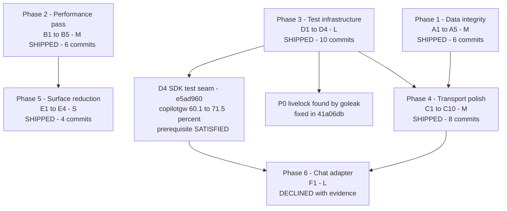
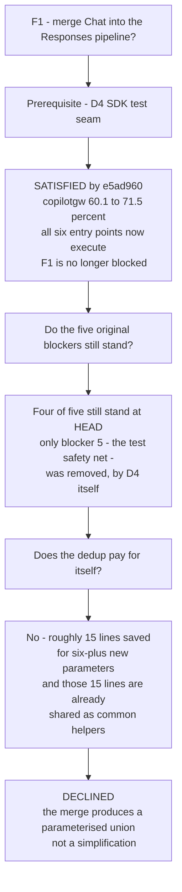

# Review Follow-Up: Completion Record

This document was a plan to correct the 24 findings that stayed open after the
first cycle of code-review fixes (`002cfc9..f33fbd4`). The team then did that
work: **35 commits on `evlouie/code-review-fixes` (`e9520e2..0fc27a8`)** closed
Workstreams A, B, C, D and E completely. The team examined Workstream F again
and **declined** it. The plan asked for this examination.

The document is now a **completion record**. Each item shows the commit that
closed it, and the measured evidence that the commit produced. Where the plan
was incorrect, the item also shows the correction that the work made necessary.
The [Residual backlog](#residual-backlog) collects the work that remains.

**The scope does not change.** Compatibility with the past behavior of this
proxy is not a goal. The only compatibility limit is the real OpenAI API and the
target functionality.

---

## Contents

- [The main outcome](#the-main-outcome)
- [Three corrections to the plan](#three-corrections-to-the-plan)
- [Prioritisation framework](#prioritisation-framework)
- [Sequencing — what shipped](#sequencing--what-shipped)
- [Workstream A — Correctness & data integrity](#workstream-a--correctness--data-integrity)
- [Workstream B — Hot-path performance](#workstream-b--hot-path-performance)
- [Workstream C — Transport & protocol polish](#workstream-c--transport--protocol-polish)
- [Workstream D — Test & release engineering](#workstream-d--test--release-engineering)
- [Workstream E — Surface reduction](#workstream-e--surface-reduction)
- [Workstream F — the decision](#workstream-f--the-decision)
- [Round two — adversarial review](#round-two--adversarial-review)
- [Round three — the live suite](#round-three--the-live-suite)
- [Residual backlog](#residual-backlog)
- [Definition of done](#definition-of-done)

---

## The main outcome

The plan said that no remaining item was in the P0 class. The P0 class contains
a defect that blocks or kills the process. That statement was incorrect. The
work that showed the error is the most valuable result of this cycle.

> [!CAUTION]
> **D2 found a true P0 livelock. `41a06db` corrects it.** A Responses WebSocket
> client can stop _without_ a close handshake. A lost network or a killed client
> does this, and so does any condition that gives a RST in place of a close
> frame. The handler goroutine of the connection then ran at full speed **for
> the full life of the process**.
>
> `wsjson.Read` failed, but it gave no error that the loop accepted as terminal.
> `coder/websocket` closed the connection before this point, thus the error was
> `net.ErrClosed` and not a `CloseError`. `connCtx` was still active, because
> nothing stopped the connection. `net/http` also does not cancel the context of
> a hijacked request. The loop wrote an error frame, which also failed
> immediately, and then read again. This continued without end.
>
> The handler never returned, thus it never got to `state.close` or
> `state.wait`. The **warm SDK session of the connection stayed connected, and
> its `sessionstore` retention pins stayed held**. Each dead client also used
> one CPU core fully. One `-count=1` run of `internal/httpapi` left **three** of
> these goroutines. All three were at the same code position, and all three were
> still present after 55 s of retries.

This is the usual case, and not a rare one. Clients stop frequently without a
close handshake.

> [!IMPORTANT]
> This result agrees with the claim of the plan. The plan said that D4 and D2
> gave the largest result for the effort. The addition of `go.uber.org/goleak`
> to one package found a bug in **one test run**. The bug stayed for the full
> life of the process. A complete manual code review and the full previous fix
> cycle did not find it. Leak detection is not a small task of hygiene. It is
> the only tool here that looks at the behavior of the code after the
> assertions pass.

---

## Three corrections to the plan

Three items had incorrect instructions in the plan. The work found each error.
This document records each error as a correction, and does not remove it. In
every case the version of the plan looked correct. A person would have written
the code as the plan said.

### B2 — the premise was false

> [!WARNING]
> The plan said that `len([]rune(s))` allocates `4×len(s)` bytes and then
> discards them immediately. The plan gave the figure "about 800 KB for each 200
> KB response". **This is not correct.** The Go compiler changes
> `len([]rune(s))` into a count of the runes. The two forms measure the same:
>
> ```
> BenchmarkRuneSliceLen-10        138471 ns/op   1685.00 MB/s   0 B/op   0 allocs/op
> BenchmarkRuneCountInString-10   138252 ns/op   1687.67 MB/s   0 B/op   0 allocs/op
> ```
>
> There was no hidden 800 KB. `8451210` removed the true cost. The true cost was
> an **O(n) scan of the runes** of every final assistant message, reasoning
> block and turn text. The code did this scan always. The code also made **854 B
> and 5 allocations of `[]any` attribute slices for each turn event, at the
> `info` level**. Go evaluates the arguments before the call, thus the check of
> the level inside `r.debug` gave no advantage. The fix puts the three code
> positions behind the `debugEnabled` flag that the loop calculates already.
> With debug off: **139061 ns/op → 0.32 ns/op, 854 B → 0 B, 5 allocs → 0
> allocs**. The code keeps `utf8.RuneCountInString` because it is clearer, and
> not because it is the fix.

### C2 — the prescribed fix was unsafe

> [!WARNING]
> The plan said: _"Swap the order: `cancel()` first, then `conn.Close(...)`."_
> With `coder/websocket` v1.8.15 this cuts the TCP connection, and it races the
> close frame. The library installs a `context.AfterFunc` on the read context,
> and that function calls `Conn.close`.[^wsclose]
>
> **Measured:** the simple swap changed
> `TestServerShutdownClosesActiveWebSockets`. The test gave a controlled
> `StatusGoingAway` close before the swap. After the swap it gave an **abnormal
> close 4 times out of 10**.
>
> `0747461` divided the two roles in place of the swap. `connCtx` is the
> **work** context, and the code cancels it first. The read loop reads with the
> **parent** context of the connection, and `conn.Close` wakes it.
> `connCtx.Err()` tells the loop that a failed read comes from our own shutdown,
> and not from a fault of the client. The controlled close frame stays, and a
> new test holds this behavior. That shutdown shows as `net.ErrClosed`. This is
> the same class of error as the P0 livelock above, which is not an accident.

### C6 — the prescribed error shape was wrong

> [!WARNING]
> The plan showed `"type": "rate_limit_error"`. **That name comes from
> Anthropic. OpenAI does not use it.** OpenAI puts the _dimension_ that the
> client used fully in `type`, as `"requests"` or `"tokens"`. OpenAI puts
> `"rate_limit_exceeded"` in `code`.[^ratelimit] The Copilot SDK limits the rate
> of the requests, and not a budget of tokens. Thus `8f824a0` writes
> `type: "requests"`. `internal/httpapi/errors.go` has a comment that gives the
> reason, thus the code cannot go back to the incorrect name.

---

## Prioritisation framework

This section stays, because the [Residual backlog](#residual-backlog) uses it
for the sizes. One question gives the order of the items: **what does the user
lose if nobody corrects this?**

| Class                           | Meaning                                                      | Response                 |
| ------------------------------- | ------------------------------------------------------------ | ------------------------ |
| **Silent wrong data**           | The client gets or stores incorrect data, and sees no error  | Fix first, always        |
| **Cross-request contamination** | One request can affect another                               | Fix first, always        |
| **Resource growth**             | Goroutines, memory or disk grow without a limit in usual use | Fix in the same cycle    |
| **Wasted work**                 | Correct, but the cost increases with the load                | Group into one perf pass |
| **Ergonomics**                  | Correct and cheap, but not clear or not convenient           | When convenient          |

### Effort sizing

The sizes give the **scope and the effect on the other code**. They do not give
a duration. They are not calendar estimates, because the correct speed depends
on the person who does the work.

| Size   | Meaning                                                                                                                                                 |
| ------ | ------------------------------------------------------------------------------------------------------------------------------------------------------- |
| **XS** | A change of one line or one expression. No new test is necessary, only an assertion                                                                     |
| **S**  | One function or one file. The change is local, with one regression test                                                                                 |
| **M**  | More files in one package, or a change that crosses one package boundary. It needs a small group of tests and a careful look at the adjacent invariants |
| **L**  | It crosses more than one package, or changes a shared type or interface. It needs new test infrastructure and a release in stages across commits        |

---

## Sequencing — what shipped

Phases 1 to 5 all shipped. The necessary prerequisite of Phase 6 (the D4 SDK
seam) also shipped. This made a true decision on Phase 6 possible, in place of a
delay.



| Phase | Theme               | Effort | Commits | Outcome                                                        |
| ----- | ------------------- | ------ | ------- | -------------------------------------------------------------- |
| 1     | Data integrity      | M      | 6       | Shipped                                                        |
| 2     | Performance         | M      | 6       | Shipped, every fix measured                                    |
| 3     | Test infrastructure | L      | 10      | Shipped; found the P0 livelock                                 |
| 4     | Transport polish    | M      | 8       | Shipped; C2 and C6 corrected                                   |
| 5     | Surface reduction   | S      | 4       | Shipped; 2 env vars deleted, 2 behaviors added                |
| 6     | Chat adapter        | L      | 0       | **Declined** — see [Workstream F](#workstream-f--the-decision) |

---

## Workstream A — Correctness & data integrity

| ID     | Commit(s)            | Outcome                                                                                                                                                                                                                                                                                                                                                                                          |
| ------ | -------------------- | ------------------------------------------------------------------------------------------------------------------------------------------------------------------------------------------------------------------------------------------------------------------------------------------------------------------------------------------------------------------------------------------------ |
| **A1** | `99f760a`            | Suppression is now only a task of the edge. The code deletes `responseParams.suppressReasoning` and `ResponseRequest.SuppressReasoning`. The gateway always builds the complete response. `internal/httpapi` finds the policy one time for each request and applies `filterResponseReasoning` at the one stream funnel. `GET /v1/responses/{id}` filters the stored record **when it reads it**. |
| **A2** | `7842784`            | `ensureCall` always makes `"call_" + uuid.NewString()`. The code keeps the id of the model on `Call.SDKID`, and indexes it in a new `Batch.bySDKID` **for each batch**. Equal model ids can no longer go from one request to another request, in either direction.                                                                                                                               |
| **A3** | `0eb98d1`, `bec6806` | `warmSessionRegistry` is adjacent to `active` and `pending`, with the same contract: close, then drain. `use` and `Disconnect` both deregister. A registration after a close is **rejected**, and not absorbed. Thus a shutdown is visible to the client, and not hidden behind a `WarmResponseResult` with a dead session. The team then made a clear decision about the warm input.            |
| **A4** | `6c2d1c3`            | The counters became simple `int64` values with no `omitempty`, on `Usage` and on `ResponseUsage`. The details objects of Responses became values and not pointers. The option to be absent moved up one level, and stays there. `usageFromSDK` returns `nil` if the SDK reported no token count. If the SDK reported one count or more, the function fills all three.                            |
| **A5** | `4e5076f`, `680ed71` | A final `:suffix` is a reasoning effort **only** when it gives a canonical effort. All other text stays part of the model id. The canonical enum moved to `internal/openai/reasoning_effort.go`, as the one ordered set. `copilotgw` removed its second rank table and its normalizer. The code now checks an explicit `reasoning_effort` and `reasoning.effort` against the enum.               |

**The regression of A1 was true, and the plan found the cause correctly.** The
test failed against the parent commit. The stored record lost its reasoning item
completely. `f6dcb69` sent one filtered object to the client and to the store.
The `[!WARNING]` of the plan gave exactly this result.

**The team showed the consequence of A2, and did not only state it.** In the
tree before the fix, the two concurrent requests both published
`tool_call_id: "call_1"`. The team made that first assertion less strict, to
make the consequence visible. The `tool_call_id` of request A then pointed to
**the batch of request B**.

**The second part of A3 was a decision of judgement, and the team made it with
care.** `bec6806` uses the stored input on a resume. It does not only record the
loss in the documentation. The loss of input that the client was told was
accepted is a correctness defect. It is not an optimisation that tries its best.
The data was on the disk already. The main difficulty is that the code cannot
tell "delivered" input from "buffered" input. Thus the team added a durable
`ResponseRecord.InputPending` marker. The default value `false` means "delivered
already", thus records of v0 to v2 move to v3 with no change. The code replays
the input on one path only: the branch where the SDK session of the previous
record resumed correctly. Two limits are in the documentation at
`pendingInputPrompt`. Only text stays, and the code does not clear the flag
after it uses the input.

> [!NOTE]
> A4 and `bec6806` both changed the format of the stored record. The golden
> tests failed, as their design intends. The bytes of `goldenResponseRecordJSON`
> in A4 did not change, because its record sets every member of the usage
> already. The team added a new `goldenSparseUsageRecordJSON`. It holds the
> sparse case, which the fully-populated golden alone can never find. The golden
> thus operates correctly in the two directions.

The cost of A5 is written at the function. An effort for one model that is not
in the enum can no longer be a suffix. This is the intended exchange. An unknown
token is now a name, and not a control. A true model with the name `foo:low`
would not be accessible. The documentation gives the order of resolution, and
does not leave it unclear.

---

## Workstream B — Hot-path performance

The benchmarks came **first**, in `98d1ab0`. Thus each fix below gives a
measured difference against a committed baseline, and not a statement.
`internal/copilotgw`, `internal/sessionstore` and `internal/toolproxy` had no
benchmark files. This is the reason why nobody saw these regressions.

All figures: darwin/arm64 (Apple M1 Max), `-benchmem`, median of 6.

| ID     | Commit    | Measured outcome                                                                                                                                                                                                                                                                                                                             |
| ------ | --------- | -------------------------------------------------------------------------------------------------------------------------------------------------------------------------------------------------------------------------------------------------------------------------------------------------------------------------------------------- |
| **B1** | `a14b4cf` | `FindModelCacheHit` **78873 → 1665 ns/op**, 1201 → 25 allocs (135170 → 2688 B/op). `ModelLookupsPerRequest` 235063 → 5119 ns/op, **405 KB → 8 KB** for each request that carries an image. `ListModels` is about 4% slower, because it now takes `cache.mu` two times. It allocates the same quantity as before.                             |
| **B2** | `8451210` | **139061 ns/op → 0.32 ns/op**, 854 B → 0 B, 5 → 0 allocs with debug off. See [the correction](#b2--the-premise-was-false).                                                                                                                                                                                                                   |
| **B3** | `14f760b` | A save of a large record (4 MiB): **37.0 → 17.5 ms**, 2913 → 563 allocs, **23.6 MB → 11.3 MB** for each save. The time of a save of a small record does not change, because fsync controls it. It allocates 42% fewer bytes, but 62 more objects. A decode of a stream of tokens makes more small allocations when there is nothing to skip. |
| **B4** | `b41389c` | To close a turn with 128 tools: **691474 → 485085 ns/op**, about 30% cheaper. 1583 → 1317 allocs, **705362 → 405062 B/op**. `BenchmarkBrokerRegisterRepeat` 870 → 766 ns/op, 2 → 1 allocs.                                                                                                                                                   |
| **B5** | `594a07b` | This is a correction, and not a change of speed. The code encoded `{"enum":[9007199254740993]}` again as `…992`, and `{"maximum":1e21}` as `1e+21`, with no message. The code now decodes with `UseNumber`. This agrees with `toolcatalog.CanonicalRawJSON`, which always did this.                                                          |

The only risk of B1 is to keep the index of the ids in agreement with
`cache.models`. Thus the code makes this structural. `setModelsLocked` sets the
two fields in one critical section, and it is the only writer of the two fields.
`TestModelIndexStaysConsistentAcrossRefreshPaths` drives every path that can
replace the catalog. The test fails clearly if a change makes the rebuild
weaker.

B3 rejected the two alternatives of the plan, and gives the reasons. First,
`Store.deletedIDs` is not a set of markers for deleted records. The code fills
it only while a pin is held. Thus it cannot answer for a record that was deleted
before this process started. Second, to get `previousSession` from the `.links`
index needs a `ReadDir` and a `Stat` for each session on every save. This
exchanges a limited cost for a cost that grows with the store. A read of four
fields of the header answers the two questions exactly. Two intended differences
are in the documentation at the call position. The code now repairs a record
with a corrupt end, and does not leave it unusable. If two objects have the same
name, the first name wins.

B5 also corrected an internal error that went to the client. `schemaMap(true)`
gave the client the text
`"json: cannot unmarshal bool into Go value of type map[string]interface {}"`,
with no classification. It now returns `apierr.InvalidRequest`. The error names
the incorrect tool and the `tools` request field.

> [!NOTE]
> B4 is only partly closed. The growth is still more than linear, because
> `Register` publishes the full set of the call ids of the batch again on each
> of its N+1 calls. This is a **different** O(N²) term. It is in `Register`
> itself, and not in the expiry. See [Residual backlog](#residual-backlog).

---

## Workstream C — Transport & protocol polish

| ID      | Commit(s) | Outcome                                                                                                                                                                                                                                                                                                                                                                      |
| ------- | --------- | ---------------------------------------------------------------------------------------------------------------------------------------------------------------------------------------------------------------------------------------------------------------------------------------------------------------------------------------------------------------------------- |
| **C1**  | `a7453b0` | `requestContext` always derives with `context.WithCancel`. A `CancelFunc` with a meaning that depends on the transport that called it is not a usable contract. Before the fix, each early return in `handleWebSocketResponseCreate` left a gateway goroutine blocked on a send that no code would read.                                                                     |
| **C2**  | `0747461` | **Corrected** — see [above](#c2--the-prescribed-fix-was-unsafe). The code divides the roles, and does not swap the order.                                                                                                                                                                                                                                                    |
| **C3**  | `0747461` | `connCtx` goes into `webSocketJSONWriter`. The write context is now a 30 s child of `connCtx`, thus the two contexts limit it. Before the fix, a frame to a peer that received nothing held the mutex of the writer for the full 30 s. This happened also when the code cancelled the connection some seconds before.                                                        |
| **C4**  | `dcf7dde` | A `ResponseWriter` contains the mux. It changes a 404 or a 405 into the standard envelope with `writeErrorObject`. It changes only a response whose `Content-Type` is not JSON already. This is the exact difference between the routing defaults of `net/http` and an intended 404 from a handler. The two bodies agree with the real API. Nobody invented them.[^errshape] |
| **C5**  | `9cd3820` | The code registers `GET`/`DELETE /v1/responses/{id}` as a wildcard. It reads the id with `r.PathValue("id")` and checks it against `openai.ValidResponseID`. Before the fix, `GET /v1/responses/%2E%2E` returned 404, and it gave the gateway an id of `".."`. An incorrect id now gives a **400** that names the param `response_id`. The real API returns the same.        |
| **C6**  | `8f824a0` | **Corrected** — see [above](#c6--the-prescribed-error-shape-was-wrong). `KindRateLimit` → 429 with a `RetryAfter` that is independent of the transport. `KindUnavailable` → 503. The code uses the 503 for the message "gateway is shutting down" of `WarmResponse`, which was a 502 before.                                                                                 |
| **C7**  | `c1dc663` | The code writes `: keep-alive` comment frames on an idle SSE stream. `COPILOT_SSE_KEEP_ALIVE_INTERVAL` has the default 15 s.[^proxy] The ticker runs at one half of the interval, and it writes only when the stream is idle. Thus a busy stream carries no keep-alive frames, and the largest gap is one and one half intervals.                                            |
| **C8**  | `80160aa` | `stream_outcome` is on the access line, with three values: `completed`, `failed`, `abandoned`. The HTTP status stays 200, which is correct after the response starts. The **severity** of the record now follows the outcome. Thus a failed stream gives an ERROR line, and an abandoned stream gives a WARN line.                                                           |
| **C9**  | `a7453b0` | Included in C1. `getResponse` and `deleteResponse` now limit their reads of the store with `COPILOT_REQUEST_TIMEOUT`, as every other handler does.                                                                                                                                                                                                                           |
| **C10** | `1929ee1` | The code now accepts `logprobs` and `top_logprobs` and ignores them. This agrees with `include: ["message.output_text.logprobs"]` on the other surface. `logprobs: false` keeps its allow predicate, because it asks for nothing.                                                                                                                                            |

C7 needed a true change of the concurrency, and not only a ticker. Two writers
now use one `http.ResponseWriter`. Thus `SSEWriter` got a mutex, and every frame
goes through one `writeFrame` that takes the mutex. Without the mutex, the two
writers mix halves of two frames into one event that no client can parse. The
`stop` function that `KeepAlive` returns waits for the goroutine before it
returns. This makes `defer stop()` safe when `requestLoggingMiddleware` reads
the counter of the bytes immediately after the handler returns.

The Chat path of C8 needs a different process from Responses. Chat has no single
terminal point, because its returns for a write error are at many positions in
the event loop. Thus Chat uses `abandoned` as the default value at the entry,
and the two terminal paths replace this value. The path of a panic is correct,
because the last write of the metadata wins.

> [!NOTE]
> A later change in the same cycle replaced C10. C10 moved `logprobs` and
> `top_logprobs` into the table of rejections for strict mode only. `846871a`
> (E2) then deleted strict mode completely. Thus the code now never rejects the
> two fields, and `RequestedLogprobs` drives the debug line for a control that
> the proxy does not honour. The final state is the state that C10 wanted,
> reached by a shorter path.

C6 has a gap, and its own commit body records it. No failing assertion exists
from before the fix, and none is possible. The taxonomy had no way to give a
"429". An assertion about a 429 does not compile against the parent commit. The
concrete observation before the fix was that
`rg StatusTooManyRequests internal/` found nothing.

---

## Workstream D — Test & release engineering

### D1 — Unreliable tests with clock budgets · `54abe94`

Three tests made a `t.Fatal` conditional on a short budget of clock time. The
team made two of them fully deterministic:

- `TestRetentionLoopPrunesIdleExpiredState` — `runRetentionLoop` got an
  `onSweep` hook. The hook is nil in production, as the `modelsFetcher` seam is.
  The test waits for a prune that the loop reports as complete. The test then
  asserts on the result of that prune.
- `TestRefreshModelsDeduplicatesConcurrentForcedRefreshes` — the test moved into
  a `testing/synctest` bubble. There, `synctest.Wait` returns only after every
  other goroutine is durably blocked. This is exactly the condition that the
  assertion needs.

> [!NOTE]
> The team did **not** make the third test deterministic, and the commit says
> so. `TestResponsesWebSocketKeepsLongResponseAliveWhileGenerating` got a larger
> idle budget, from 30 ms to **250 ms**. The budget is _larger_, but the test is
> not deterministic. Its idle timeout is also the budget to accept the socket
> and to schedule the read loop. A different test holds the true rules of the
> watchdog in a deterministic way. That test is
> `internal/httpapi/responses_ws_idle_test.go`. It drives
> `watchResponsesWebSocketIdle` with a false clock of `testing/synctest`, and it
> uses no socket.

### D2 — Goroutine-leak detection · `fc5e272`, `41a06db`

The code uses `go.uber.org/goleak` with a `TestMain` in four packages. The
goroutines of these packages own an SDK session, a tool handler that waits, or a
retention pin that only that goroutine releases. The packages are
`internal/httpapi`, `internal/copilotgw`, `internal/toolproxy` and
`internal/sessionstore`. Only **two** ignores were necessary. The two are in
`internal/httpapi`, and both are for the client-side connection pool of
`net/http`. Each ignore has a comment. The comment names the loop, and gives the
reason why the loop is not ours. The other three packages check with no ignores.

The team examined eight more packages. These packages are clean, but they do not
use the check. They start no long-lived goroutines, thus the check would do
nothing there.

The result came immediately. [The main outcome](#the-main-outcome) describes it.

### D3 — `t.Parallel()` · `fb09b70`, `a330ad0`, `fd6aecf`, `62fe47a`, `650c8d1`

The change came package by package, in five commits. The commit with the largest
risk came last, and a person can revert each commit alone. The goal was never
the clock time. The goal is that `-race` now sees these packages run
concurrently. Thus hidden shared state shows as a race, and not as an accident
of the order. The team checked this with `-race -count=8`, and with `-count=10`
for `copilotgw`.

Each exception is sequential, **with a comment that gives the reason**:

| Package                              | Sequential exception                                                                                                                                                                                        |
| ------------------------------------ | ----------------------------------------------------------------------------------------------------------------------------------------------------------------------------------------------------------- |
| `cmd/copilot-api`, `internal/config` | Not parallel at all, because they change the environment of the process with `t.Setenv`                                                                                                                     |
| `internal/copilotgw`                 | `TestResolvePromptFetchesRemoteImage`, `TestWarmResolvedImageIsReusedWithoutRefetch` replace the `imageHTTPClient` of the package                                                                           |
| `internal/httpapi`                   | `TestWebSocketReadLoopEndsWhenTheClientVanishesWithoutAClose` (it uses `goleak.IgnoreCurrent`); `TestResponsesWebSocketKeepsLongResponseAliveWhileGenerating` (competition for the CPU made it fail before) |
| `internal/sessionstore`              | The hand-written-shapes table in `TestSaveResponseHeaderAgreesWithTheFullRecord`                                                                                                                            |

The last exception is the exercise that finds exactly the danger that it must
find. All those subtests write and read the same `"z"` record path. In parallel,
they read the bytes of each other.

`a330ad0` also made three waits of clock time in `toolproxy` larger, from 1 s to
5 s. A concurrent run of the suite makes a budget of 1 s more difficult, with no
advantage. The assertions of these tests did not change.

### D4 — The gateway↔SDK seam · `9b0749e`, `e5ad960`

`9b0749e` replaced the embedded **nil** `copilotgw.Gateway` in all 17
hand-written fakes with `unimplementedGateway`. Its methods panic and give their
own name. A test sends an incorrect route through the real mux. The test asserts
that the log of the recovered panic names `Gateway.CreateResponse`. No fake
needed a new override. This shows that no fake called a method with no
implementation.

`e5ad960` did the larger part, as an **extraction at the level of the types
only**. The control flow did not change:

- `copilotSession` — the four operations that the gateway does with an SDK
  session (`ID`, `Send`, `Abort`, `Disconnect`). The id is a method, because
  `*copilot.Session` has a `SessionID` field already.
- `sdkSessionOpener` and a `RealGateway.sessionOpener` field. The field is nil
  in production, as the `modelsFetcher` seam is.
- `wrapSDKSession` keeps "no session and no error" as a nil interface. Thus the
  `session == nil` guards continue to operate.

The tests then run the **true** `RealGateway`. This includes the true model
cache, prompt resolution, session filesystem, tool broker, turn runner and
`sessionstore`. Only the runtime is a replacement.

`internal/copilotgw` coverage **60.1% → 71.5%**:

| Entry point           | Before | After |
| --------------------- | ------ | ----- |
| `prepareChatTurn`     | 0.0%   | 73.7% |
| `Chat`                | 0.0%   | 89.5% |
| `StreamChat`          | 0.0%   | 77.3% |
| `prepareResponseTurn` | 0.0%   | 73.3% |
| `CreateResponse`      | 0.0%   | 76.9% |
| `WarmResponse`        | 0.0%   | 58.6% |
| `StreamResponse`      | 39.2%  | 66.7% |

---

## Workstream E — Surface reduction

| ID     | Commit    | Resolution                                                                                                                                                                                                                                                                                                                                                                                                                                                                           |
| ------ | --------- | ------------------------------------------------------------------------------------------------------------------------------------------------------------------------------------------------------------------------------------------------------------------------------------------------------------------------------------------------------------------------------------------------------------------------------------------------------------------------------------ |
| **E1** | `9105ba7` | **Deleted.** `COPILOT_API_CACHE_DIR` had no producer. Every result of `rg -n 'CacheDir\|CACHE_DIR' --type go` was connection code, or a test of that connection code. It cost a claim on a managed root, a write of a marker with two fsyncs, a retention scan of an always-empty directory in each cycle, and a purge target. The result was only a guarantee that an empty directory stays empty. **BREAKING.**                                                                    |
| **E2** | `846871a` | **Deleted.** `COPILOT_STRICT_COMPAT` reached three call positions. Each of its additions was a _rejection_ of an item that the permissive policy classified as safe to ignore already. Its stated purpose was to debug the conformance of a client. The debug logs for a control that the proxy does not honour give this already, and they do not break the client. **BREAKING.**                                                                                                   |
| **E3** | `0fc27a8` | **Enforced in this proxy.** The tool field `strict` now compiles the parameters that the client declares, at the time of the request. It then checks the arguments of the model against them. It does this at _both_ points of materialisation (`CaptureRequests` and `handleInvocation`), because their order is not guaranteed. The code **forwards** `defer_loading`, and does not reject it: `true` → `ToolDeferAuto`, `false` → `ToolDeferNever`, absent → the runtime decides. |
| **E4** | `7b2f085` | **Fsynced.** `AppendFile` was the last write path in `sessionfs` with no guarantee of durability. The code syncs the parent directory only when the append created the name. Thus the code pays for the extra barrier one time for each file, and not one time for each append.                                                                                                                                                                                                      |

E2 did not leave the decision open. The plan demanded this clearly. The answer
is that the permissive policy is the only policy. Every common OpenAI client
sends `temperature` or `user` by default. Thus strict mode returned a 400 to
almost every true client. The mode was all or nothing, with no control for each
field.

Evidence decided the choice of E3 between "enforce" and "400", and not a
preference. `TestHTTPAcceptsValidOpenAIClientRequests` holds a Chat request with
`{"strict":true}` at 200 already, and gives the reason. A client with many users
sends these calls by default. Real OpenAI accepts `strict` and honours it. Thus
a 400 is not correct against the behavior of real OpenAI. Two consequences are
intentional. First, a strict tool with a schema that does not compile gets a 400
**at the time of the request**. A guarantee that the proxy can never enforce
must fail before the user pays for tokens. Second, `strict` on a custom tool
with free text gets a 400, because the client declares nothing to limit.

Keep the reasons for E4. The answer "a lost append costs nothing" is attractive,
but it is incorrect. A continuation of Responses first tries `resumeSession` on
the SDK session id from the previous record. It reads the session store again
only when that resume fails. Thus an event log that is short, with no message,
means that the resume **succeeds**. The model then answers without the turn
whose id the client gave as `previous_response_id`. This is a loss of context
with no message, and not a visible fallback.

> [!NOTE]
> **The team checked the configuration surface: 24 → 23 documented variables**
> in the Configuration table of `README.md`, with `GITHUB_TOKEN`. E1 and E2
> removed two variables. C7 added `COPILOT_SSE_KEEP_ALIVE_INTERVAL`. E1 also
> removed the managed storage root, which is the larger structural advantage.
> `prune` and `purge` no longer touch any file under `.cache`. The Dockerfile,
> the compose file and the README now say this clearly.

---

## Workstream F — the decision

### F1 — Chat Completions as an adapter over Responses: **declined**

The plan said: _"Re-evaluate whether the dedup is worth it before committing to
Phase 6; the honest answer may be no."_ The team examined it again against HEAD.
**The answer is no.**

This is a decision with evidence, and not a delay.



#### The prerequisite is satisfied — F1 is not blocked, it is not worth it

`e5ad960` added the seam at the boundary of the SDK (`copilotSession` and
`sdkSessionOpener`). The plan named this seam as the necessary prerequisite of
F1. With the seam, all six gateway entry points that had 0% coverage now execute
in the tests. Blocker 5 of the original five is thus not present. That blocker
said: "the compatibility-contract tests are written against the Chat types, so
the refactor removes the safety net and the thing it protects in the same
change". The `[!CAUTION]` that the plan gave to F1 does not apply now.

The text below is a judgement about value, and not about safety.

#### Four of the five original blockers still stand, verified against HEAD

1. **`ReasoningOpaque` still has no field on `openai.Response`.** It is on
   `copilotgw.TurnResult` (`internal/copilotgw/types.go:108`), and only
   `internal/httpapi/chat.go:299` uses it. That code builds `reasoning_details`
   from it. To derive a `ChatCompletion` from a `Response` still loses it.
2. **A `Response` still cannot give `finish_reason`.** `responseFromTurn` writes
   `Status: "completed"` as a constant
   (`internal/copilotgw/turn_runner.go:1153`). `FinishReason` exists only on the
   Chat type (`internal/openai/chat.go:175`) and on its `TurnResult` carrier
   (`types.go:114`).
3. **The identity of the reasoning is still different on the two sides, by
   design.** `TurnResult.reasoningOutputItemID()` (`turn_runner.go:1277`) makes
   the `rs_` id of the output item. `reasoning_details[].id` is the reasoning id
   of the SDK. These are different values, and this is intentional.
4. **The mapping of the usage still goes in one direction.** `NewResponseUsage`
   adds `input_tokens_details.cached_tokens` (`internal/openai/models.go:92`).
   Chat has no field for it. `6c2d1c3` changed the usage very much, but it did
   not make the mapping work in two directions. It made the two sides complete,
   which is a different property.

#### The dedup itself does not pay

Measured at HEAD:

- `prepareChatTurn` has **53 lines** (`internal/copilotgw/chat.go:28-80`), and
  it is **always stateless**. It makes a new `chat_` session for each request.
  It puts the full history into session events. It never reads a previous
  record, a warm session or a tool catalog.
- `prepareResponseTurn` has **125 lines**
  (`internal/copilotgw/response_session.go:28-152`). Its structure is exactly
  those three branches.

A merge of the two functions needs a minimum of: a `stateless` flag, a branch
for a catalog or for raw tools, an option to stop the persistence, a parameter
for the kind of the batch, a variant for the `retained` path, and a prefix for
the error `param` that the client sees (`"messages"` against `"input"`). These
are six parameters or more, and they save about 15 lines.

The two functions **share those 15 lines already**. `requestReasoningEffort`,
`resolvePromptWithImageBudget`, `newSessionEventSink` and `resumeSession` are
common helper functions today. Other work removed the duplication that the plan
wanted to remove. Each function keeps only the part that is truly different.

> [!IMPORTANT]
> The merge gives a **union with parameters, and not a simpler design**. The
> plan gave exactly this warning in its caveat. To decline is to follow the
> recommendation of the plan, and not to reject it.

The parts of the first attempt (`6e9d3ce`, `ed2d02c`, `f33fbd4`) that have value
alone shipped before, and they stay. These parts are the replay of the hydration
for a cold continuation of Responses, the unified reconciliation of the terminal
text, and the unified stream sink.

---

## Round two — adversarial review

After the workstreams shipped, three sub-agents reviewed the result. Each
sub-agent had a different scope: concurrency and lifecycle, conformance of the
wire protocol, and data integrity. Each sub-agent had the instruction to find
defects. The instruction said that a report of "looks good" is a failed review.
Together they found **fourteen** defects in the work above. Four defects were
serious, and they would have caused true damage. Two of the fixes that the
sub-agents proposed were also incorrect.

> [!CAUTION]
> Two of the findings with the highest severity were **regressions from the
> fixes in this document**, and not defects from before. `0747461` (C2)
> corrected one race of an abnormal close. It then made the same race again one
> layer higher, through the frame writer that it connected to `connCtx`.
> `bec6806` (A3) corrected one loss of warm input, and left two more losses on
> adjacent paths. A fix that passes the tests is not evidence that the fix is
> correct.

### What was found and fixed

| Finding                                                                                                                                                                              | Severity | Fix       |
| ------------------------------------------------------------------------------------------------------------------------------------------------------------------------------------ | -------- | --------- |
| The `AfterFunc` of the write timeout cut the close handshake. The C2 fix made the race again. Measured: **15/20 runs failed, 28/160 shutdowns abnormal**                             | High     | `b18e0ca` |
| A request that got to `newTurnRunner` after `Stop()` waited **without end** and leaked its goroutine. The reasoning of `0eb98d1` about the order of the registry was incorrect       | High     | `8a6a582` |
| Warm requests in a chain lost the earlier input with no message. The code never cleared `InputPending`, thus a usual retry sent the input two times                                  | High     | `5ff87ec` |
| A record with a cut end decoded as a _complete_ header, because `json.Decoder.More` hides the read error. This made deleted responses live again, and left retention links unusable  | High     | `78eec33` |
| The code could install a warm session into a WebSocket state that was closed already                                                                                                 | Medium   | `a47c536` |
| `state.finish()` raced the next `response.create`. Thus a correct client got an incorrect error "only one response.create may be active" in **4/10 runs**                            | Medium   | `5c902fe` |
| `cached_tokens` was the constant 0, but the SDK reports it. `cache_write_tokens` was absent, but the schema needs it                                                                 | Medium   | `4e36ce0` |
| Old usage records had a `total_tokens` that did not agree with their own parts                                                                                                       | Medium   | `4e36ce0` |
| The terminal Chat usage chunk could carry `"usage": null`                                                                                                                            | Medium   | `4e36ce0` |
| Strict tool schemas that this proxy only cannot _compile_ gave a 400. These include Draft-07 forms and any external `$ref`, which real OpenAI accepts                                | Medium   | `cd51cc7` |
| A violation of a strict argument reached the client as a 502 or a 500 with no class, and with no tool name                                                                           | Medium   | `cd51cc7` |
| The classification of the rate limit never ran at the SDK call positions. The most probable point of a limit still returned 502                                                      | Medium   | `93e3239` |
| The code accepted `metadata` and removed it with no message, but the real API returns it                                                                                             | Medium   | `10b9195` |
| `GET /v1/models` published `model:effort` aliases, and `POST` then answered them with 404                                                                                            | Medium   | `10b9195` |
| The accept-and-ignore behavior was not visible for about 12 fields. `AppendFile` could omit its sync of the directory. `bindBroker` inherited its invariant, and did not enforce it | Low      | `08ea85d` |

### Two proposed fixes that were wrong

A measurement rejected the two fixes, and not an argument. This is the same
standard that found the three errors of the plan in the previous round.

- **`UseNumber` for strict arguments.** The review proposed to decode the
  arguments of a tool with `UseNumber`, to agree with `schemaMap`. A measurement
  against `jsonschema-go` v0.4.3 shows that this breaks **every strict tool with
  a number**. The library reflects over the instance, and it gives a
  `json.Number` the type `"string"`. Thus `{"n":5}` against `{"type":"integer"}`
  reports `5 has type "string", want "integer"`. The literals of the schema and
  the instance go through `float64` already, thus they compare correctly. The
  code did not change. The reason is now at the call position, thus nobody
  proposes the change again.
- **`quota` → keep 502.** The previous round said that a retry cannot remove a
  block on the billing. That argument gives the opposite result. The official
  SDKs retry a 5xx on their usual schedule. Thus the 502 caused _more_ automatic
  retries than the 429 that it avoided. The code now returns 429
  `insufficient_quota`, as the real API does. This changed the decision of round
  one, and it **deleted** the entry of that decision in the backlog. The `R6`
  position below now holds a different item.

### The finding that justifies the work

`goleak` (D2) found a **P0 livelock**. A complete manual review did not find it.
A WebSocket client can stop without a close handshake. A lost network or a
killed client does this, and this is the usual case. The handler goroutine then
ran at full speed for the full life of the process. `wsjson.Read` returned
`net.ErrClosed`, and no terminal condition of the loop matched that error.
`connCtx` was still active. The handler never returned. Thus the code never
disconnected the warm SDK session of the connection, and never released its
retention pins. One `-count=1` run left three goroutines.

---

## Round three — the live suite

Unit tests and fakes checked all the work above. The Deno AI SDK suite is the
only check that uses the **true** parser of the Vercel AI SDK with the **true**
Copilot upstream. The suite is `ignore`d if `COPILOT_API_AI_SDK_DENO_TESTS=1` is
not set. Thus CI ran only the one test that asserts that the suite is disabled.
A run against a live subscription reported **19 passed, 3 failed**.

The three tests failed in the same way on `002cfc9`. Thus no failure was a
regression from this work. The test file has the same bytes in the two commits,
which makes the comparison exact. The three failures divide into two groups.

> [!CAUTION]
> **One failure was a true defect. The error frame of the Responses WebSocket
> had no `sequence_number`. `825e3dc` corrects it.** Every schema that an OpenAI
> client uses for an `error` stream event needs that field. `@ai-sdk/openai`
> 4.0.20 has the chunk union
> `[nested-error, flat-error, {type: string}.loose()]`. Without the field, the
> two error branches fail, and the frame matches the last branch. The transform
> of the stream then maps the frame to `unknown_chunk` and **removes it**.
>
> Observed live: a client sent an unknown `previous_response_id` on the
> WebSocket transport. The client saw an empty stream with no error, and the
> stream reported success. The same request on REST correctly returned
> `400 previous_response_not_found`. The logic of the proxy was correct, and
> only the shape of the frame was incorrect. No quantity of tests on the Go side
> can find this class of defect.

The frame now carries the error **flat and nested**. The clients of OpenAI do
not agree about the position of the error, and this proxy must satisfy the two
forms. openai-dotnet reads `code`, `message` and `param` at the top level, as
the published `ResponseErrorEvent` shows.[^errorevent] The live service writes
`{"error": {...}}`. An OpenAI maintainer confirmed that the service does not
honour its own contract.[^dotnet881] The streaming code of openai-python reads
`error.message`, and it operates only with that nested shape.[^python2487]

### The other two failures came from incorrect tests

The two cases of the reasoning effort asserted that a model with reasoning
_writes_ reasoning. That is not the contract of this proxy. A model does not
guarantee this property.

> [!WARNING]
> Measured against `claude-sonnet-5` at `effort=low`: the prompt _"reply with
> one concise sentence about why 19 \* 37 = 703"_ gave **zero reasoning items
> and zero reasoning tokens in 3 of 3 runs**. The same model, at the same
> effort, with the prompt _"What is 17\*24? Think it through."_ gave a reasoning
> item every time. The proxy forwarded the effort correctly. It reported
> correctly that the model did not do reasoning.

`28f392d` wrote the two tests again. They now assert the property that the proxy
_is_ responsible for: a real OpenAI client can use the reasoning that the
response of the proxy carries. A `fetch` that records captures the exact bytes
of the turn that the SDK parsed. Thus the true data and the visible surface come
from one response, and not from two calls with different results. The tests
check three claims separately, because the claims are not equally strong. First,
text on the wire must reach the client. This claim is the strongest. Second, an
item with no text must stay as a part of the reasoning. Third, reported
reasoning tokens must reach `usage`. The third claim is the weakest, because the
SDK reads the same field. If the upstream service wrote nothing, the test skips
the assertion, and does not fail it.

> [!TIP]
> **An injected fault checked the new tests. A pass alone did not check them.**
> A patch made the proxy write the reasoning text under `"summary_text"` and not
> under `"text"`. The text was still on the wire, but under a key that the
> parser of the SDK does not read. The two tests fail with this patch. An
> earlier version of the same check passed with the fault, and the team removed
> it. "The assertion passes" and "the assertion can fail" are different claims.
> Only the second claim has value.

That round also corrected a hidden defect in the old assertion. The assertion
read `usage.reasoningTokens`. The AI SDK puts this value under
`usage.outputTokenDetails.reasoningTokens`. Thus that fallback value was always
`0`.

Live suite after this round: **22 passed, 0 failed.**

---

## Residual backlog

This is the work that remains after the two rounds. No item here is a defect of
correctness or of contamination. The highest class here is **wasted work**, with
some intended limits of the scope. Round two added R6 to R9. These are limits in
the documentation, and not open defects.

| ID     | Item                                                                                                                                                                                                                                                                                                                                                                                                                                                                                                                                                                                                                                                          | Class       | Effort |
| ------ | ------------------------------------------------------------------------------------------------------------------------------------------------------------------------------------------------------------------------------------------------------------------------------------------------------------------------------------------------------------------------------------------------------------------------------------------------------------------------------------------------------------------------------------------------------------------------------------------------------------------------------------------------------------- | ----------- | ------ |
| **R1** | `Broker.Register` (`internal/toolproxy/toolproxy.go:174-198`) publishes the **full** set of the call ids of the batch again on each of its N+1 calls. This is a remaining O(N²) term, separate from the term of the expiry hook that `b41389c` corrected. The team wrote a set of the ids that are published already, measured it, and **reverted** it. The set removed only the inserts into the map, and not the O(N) iteration that dominates. It also _added_ allocations at a small N (1720 → 1992 B/op at `tools=1`), for less than 4% at `tools=128`. A correct fix needs `ensureCall` to give `Register` the ids that it made, which changes the API. | Wasted work | **M**  |
| **R2** | `prepareResponseTurn` tries `resumeSession` again one time **for each candidate of the instructions**. `openai.InstructionCandidates("")` gives two candidates: `" "` and a fallback system prompt. `resumeSession` loops over them (`internal/copilotgw/sessions.go:92-107`). Thus one refused resume makes two SDK calls before the fallback. This makes the latency of a cold continuation two times larger for requests with no instructions.                                                                                                                                                                                                             | Wasted work | **S**  |
| **R3** | E3 does **not** enforce the strict _subset of the schema_ of OpenAI (`additionalProperties: false`, and every property in `required`).[^strict] Real OpenAI returns a 400 for a strict schema that does not obey this subset. This proxy checks the arguments against the schema that the client declared. A client with a schema in the strict form gets the same guarantee in the two cases. A client with a different schema gets a weaker guarantee than OpenAI gives, and sees no message.                                                                                                                                                               | Ergonomics  | **S**  |
| **R4** | E3 added **no retry loop** for a violation of a strict schema. A tool call that does not obey the schema fails the turn with an error that names the tool. The proxy does not send the call back to the model for a correction. `0fc27a8` says that this is intentional, because this proxy does not own the decoding loop of the model. It is a true difference of behavior against the constrained decoding of OpenAI, which cannot write a call that does not obey the schema.                                                                                                                                                                            | Ergonomics  | **M**  |
| **R5** | The `RetryAfter` field of `apierr.RateLimited` is connected, mapped to an RFC 9110 `Retry-After` header, and tested from end to end. But the field is **not reachable in production**. The Copilot SDK gives no retry-after value on `SessionErrorData`. Thus the code passes `0`, and it never writes the header today. The field exists so that the taxonomy can carry a wait time when a source for that value exists.                                                                                                                                                                                                                                     | Ergonomics  | **XS** |
| **R6** | `classifyUpstreamError` classifies the failures of an SDK call by a **match of the text** of the error. The SDK returns `*internal/jsonrpc2.Error`, which is not an exported type. Thus `err.Error()` — `"JSON-RPC Error %d: %s"` — is the only signal. No code can read its `Code` or its `Data`. An incorrect match costs the client an unnecessary backoff. Examine this again if the SDK exports its error type.                                                                                                                                                                                                                                          | Ergonomics  | **S**  |
| **R7** | The `cleanPath` function of `ServeMux` removes an unencoded `..` in a path with a response id **before** any handler runs. Thus `GET /v1/responses/..` returns a `307` with an HTML body. This is outside the JSON envelope that `dcf7dde` guarantees. The code correctly rejects an encoded `..` (`%2E%2E`) with a 400. The team leaves this as it is, with intent. To intercept the redirects and change them can break correct redirects, for a path that no client sends on purpose.                                                                                                                                                                      | Ergonomics  | **S**  |
| **R8** | The delivery of the warm input happens **one time or more**, and not exactly one time. The code retires the pending claim only after `Send` returns. Thus a crash between that return and the write to the store replays input that the conversation has already. To clear the claim first makes every failed send a loss of input with no message, and the client was told that the input was accepted. A repeated turn is recoverable, but a lost turn is not. On the streaming path, the send goroutine writes the claim. This makes the window larger, from "a crash" to "another request resumed the same warm id some milliseconds later".              | Ergonomics  | **M**  |
| **R9** | The proxy accepts a strict tool schema that it cannot compile, and it does **not enforce** the schema. It writes a log line at the warn level. This is the controlled degradation, because a 400 would break integrations with schemas that real OpenAI accepts. But `strict: true` is not a guarantee on those tools.                                                                                                                                                                                                                                                                                                                                        | Ergonomics  | **S**  |
| **F1** | Chat Completions as an adapter over Responses. **Declined**, with evidence — see [Workstream F](#workstream-f--the-decision). The item is here so that nobody proposes it again with no discussion. Open it again only for a _new_ reason, and not because the prerequisite exists now.                                                                                                                                                                                                                                                                                                                                                                       | —           | **L**  |

> [!TIP]
> R1 and R2 are the only two items with a cost that increases with the load. R2
> is much cheaper. It is one condition on the question if the instructions were
> empty. Do R2 first when you start this list. R8 is the only entry that can
> still give a user an unexpected result, and only after a crash.

---

## Definition of done

Every commit in this record satisfied the checks of
[`.github/workflows/ci.yml`](../.github/workflows/ci.yml). You can do the same
checks locally with `make ci`:

- [x] `gofmt -l .` — empty
- [x] `go build ./...`
- [x] `go vet ./...`
- [x] `go test ./... -race -count=1`
- [x] `staticcheck@v0.7.0 ./...` — zero findings
- [x] `deno fmt --check`, `deno check tests/ai-sdk-deno`,
      `deno task test:ai-sdk`

The Deno suite is off by default. Thus the last line shows only that the suite
is disabled. The team also ran the suite **against a live Copilot
subscription**: 22 passed, 0 failed. Round three above records this run. No
other test here used the true upstream service.

Three standards come from the review cycle. All three showed their value again:

1. **Show the defect before you correct it.** Write the regression test first.
   Run it against the parent commit. Record the failure that you see in the body
   of the commit. Every A item and C item above has one. For C6 this was _not
   possible_, because an assertion about a 429 does not compile against a
   taxonomy with no 429. The commit says this, and it gives the best other
   concrete observation.
2. **Treat a failure of a golden test as a finding, and not as a small task.**
   A4 and `bec6806` both broke `internal/sessionstore/record_golden_test.go` for
   a correct reason, and both say this in the commit message. A4 also added
   `goldenSparseUsageRecordJSON`, because the fully-populated golden cannot find
   the sparse case.
3. **Check the external facts.** This gave value three times. The plan stated
   the premise about `len([]rune(...))` (B2), the order of the WebSocket close
   (C2) and the shape of the 429 envelope (C6) incorrectly. The team corrected
   each one, because it checked each one: with a benchmark, with a measurement
   of ten runs, and with the issue reports of the upstream projects. The 404 and
   405 bodies in C4 and the meaning of `defer_loading` in E3 also come from
   primary sources, and nobody invented them.

[^usage]: OpenAI Responses API — `usage.input_tokens`, `output_tokens` and
    `total_tokens` are necessary integers on the usage object.
    `input_tokens_details` and `output_tokens_details` are always present.
    <https://developers.openai.com/api/reference/resources/responses>

[^proxy]: The AWS Application Load Balancer has a default idle timeout of 60
    seconds, and Cloudflare has 100 seconds. The two services stop a connection
    with no bytes in transfer. The timeouts of the origin server have no effect
    on this.
    <https://docs.aws.amazon.com/elasticloadbalancing/latest/application/application-load-balancers.html#connection-idle-timeout>

[^wsclose]: `coder/websocket` v1.8.15 installs a `context.AfterFunc` on the read
    context in `setupReadTimeout`, and that function calls `Conn.close`. Thus a
    cancel of the context that the read loop uses cuts the connection. It does
    not only stop the read. <https://github.com/coder/websocket>

[^ratelimit]: The 429 envelope of OpenAI uses `code: "rate_limit_exceeded"`. The
    `type` field names the dimension that the client used fully (`"requests"` or
    `"tokens"`). A maintainer of openai-node gives this in
    <https://github.com/openai/openai-node/issues/168>, and
    <https://github.com/openai/openai-python/issues/2703> shows it again.
    `"rate_limit_error"` is the vocabulary of Anthropic.

[^errshape]: The text of the 404 (`Invalid URL (POST /v1/embeddings)`) is the
    same in <https://github.com/openai/openai-node/issues/132> and
    <https://github.com/openai/openai-python/issues/250>. The text of the 405
    (`Only POST requests are accepted.`) and the code `method_not_supported`
    come from <https://github.com/openai/openai-python/issues/2703>.

[^strict]: The subset for structured outputs of OpenAI needs
    `additionalProperties: false` on every object, and every property in
    `required`. OpenAI rejects a strict function schema that does not obey this,
    with a 400 at the time of the request.
    <https://platform.openai.com/docs/guides/function-calling#strict-mode>

[^errorevent]: The `ResponseErrorEvent` of OpenAI carries `code`, `message`,
    `param` and `sequence_number` at the top level.
    <https://developers.openai.com/api/reference/resources/responses/streaming-events/>

[^dotnet881]: An OpenAI maintainer confirms that the service returns the nested
    `{"error": {...}}` shape, and not the flat shape in the documentation. The
    maintainer calls this a violation of the contract by the service.
    <https://github.com/openai/openai-dotnet/issues/881>

[^python2487]: The streaming code of `openai-python` reads
    `data["error"]["message"]`. Thus it knows only the nested shape.
    <https://github.com/openai/openai-python/issues/2487>
