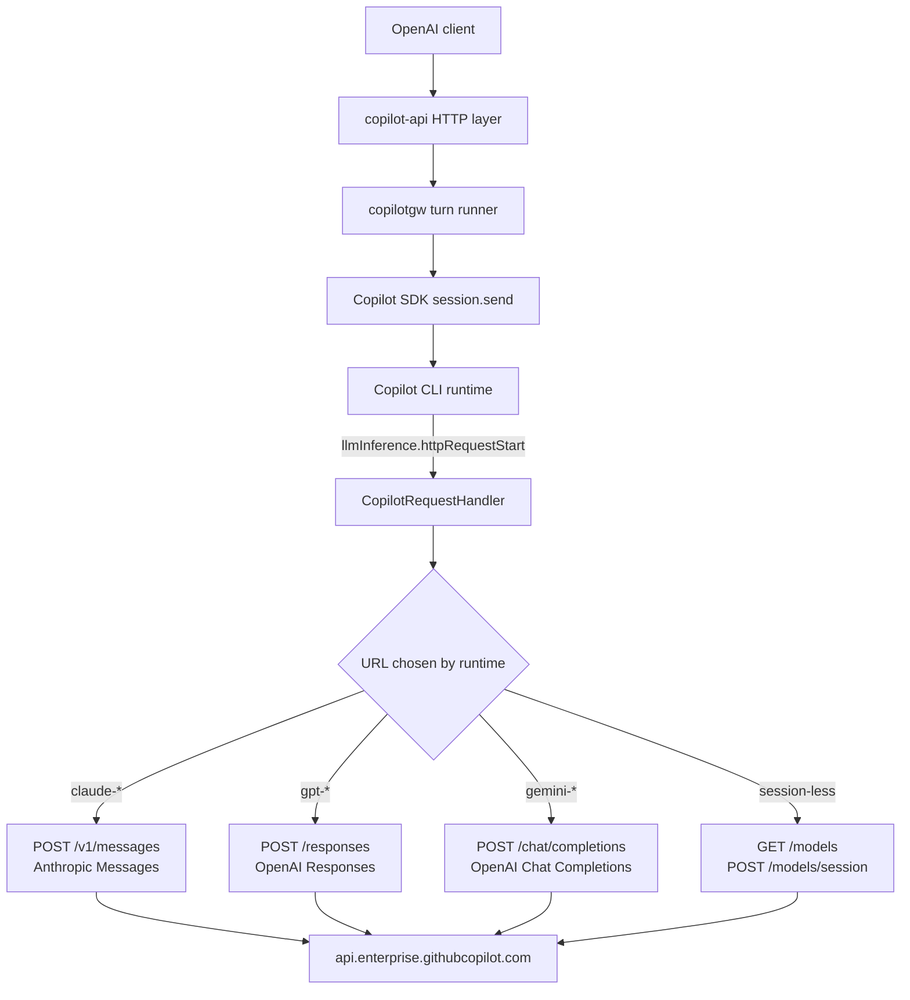

# Spike: CopilotRequestHandler as an injection seam

Date: 2026-07-26

Issue: [#4](https://github.com/evanlouie/copilot-api/issues/4)

## Verdict

**Qualified go, but much more limited than the hypothesis.**

The hypothesis was "one seam fixes four limitations because the intercepted
payload is OpenAI-shaped". That statement is **false**. There is no single
payload shape. The runtime speaks a **different provider-native wire dialect for
each model family**. The four limitations are available in a different way in
each dialect. In some dialects they are not available at all.

The items that follow are true. A live account proved them from end to end:

- The injection of `text.format` with a `json_schema` into the **OpenAI
  Responses** dialect (`gpt-*`) **works**. A prompt that usually returns prose
  returned `{"age":36,"name":"Ada Lovelace"}` through the Chat Completions path
  of the proxy.
- The same injection into the **OpenAI Chat Completions** dialect (`gemini-*`)
  got **HTTP 200, but the service ignored it**. The model returned prose. This
  failure mode is the worst one. We would advertise a capability that does not
  operate.
- The **Anthropic Messages** dialect (`claude-*`, and the dialect that the
  default `auto` router selects) has **no `response_format` field and no
  `json_schema` field**. There is nothing to inject.

Thus: continue with **structured outputs**. Control them for each dialect, and
set them off by default. Continue to return the existing `400` error for the
model families that cannot enforce them. Do **not** use this seam as a control
plane for general purposes. Do not add `tool_choice`, `parallel_tool_calls` or
`max_tokens` in the same change.

Read [Recommendation](#recommendation) for the steps. Read [Risks](#risks) for
the two results that must control a merge. The first result is an experimental
RPC surface. The second result is an unbounded hang when the upstream service
rejects an injected request.

## What I did

I did a static analysis of the SDK. Then I did four live probes against a real
Copilot subscription.

The probe is a temporary test harness at
`internal/copilotgw/spike_request_handler_probe_test.go`. It builds a real
`RealGateway`. Then it **replaces the SDK client of that gateway** with a client
that has a `copilot.CopilotRequestHandler` installed:

```go
transport := newSpikeCapturingTransport()
transport.mutate = mutate
opts := newRealClientOptions(cfg)
opts.RequestHandler = &copilot.CopilotRequestHandler{Transport: transport}
gw.client = copilot.NewClient(opts)
```

The production code does not change. `newRealClientOptions` still returns a
configuration with no handler. Thus nothing changes in the request path that we
release.

The custom `http.RoundTripper` does these operations:

- It copies the behavior of the default transport of the SDK
  (`DisableCompression = true`, see `copilot_request_handler.go:44`).
- It reads and records the request body. It can also rewrite the body. Then it
  sends the body again.
- It puts the **response** body in a tee, and does not put it in a buffer. Thus
  the stream continues, and the capture is only a secondary effect.
- It removes the credential headers **and** the JSON body fields that contain
  credentials. It does this before it writes anything to disk.

### Reproducing

All probes skip if `COPILOT_API_LIVE_TESTS=1` is not set. This agrees with the
convention in `internal/copilotgw/live_test.go`.

```sh
# Pass-through capture (question 1, 3, 5, 6)
COPILOT_API_LIVE_TESTS=1 \
COPILOT_CLI_PATH=/path/to/copilot \
COPILOT_API_LIVE_MODEL=gpt-5.5 \
COPILOT_API_SPIKE_CAPTURE_DIR=/tmp/spike \
  go test ./internal/copilotgw/ -run TestSpikeCopilotRequestHandlerCapture -v

# Structured-output injection (question 2)
COPILOT_API_LIVE_TESTS=1 \
COPILOT_CLI_PATH=/path/to/copilot \
COPILOT_API_LIVE_MODEL=gpt-5.5 \
  go test ./internal/copilotgw/ \
  -run TestSpikeCopilotRequestHandlerStructuredOutputInjection -v

# Hot-path failure mode. Opt-in twice, because it does not terminate.
COPILOT_API_LIVE_TESTS=1 COPILOT_API_SPIKE_BAD_INJECTION=1 \
COPILOT_CLI_PATH=/path/to/copilot \
  go test ./internal/copilotgw/ \
  -run TestSpikeCopilotRequestHandlerBadInjection -v -timeout 120s

# Control: same class of upstream failure with no handler installed
COPILOT_API_LIVE_TESTS=1 \
COPILOT_CLI_PATH=/path/to/copilot \
  go test ./internal/copilotgw/ \
  -run TestSpikeUpstreamErrorWithoutInterception -v -timeout 120s
```

The environment for each result that follows:

- Copilot Go SDK `v1.0.6`, Copilot CLI `1.0.75`, protocol `3`
- Host `api.enterprise.githubcopilot.com`
- Auth: the CLI's own logged-in user (`GITHUB_TOKEN` unset)
- macOS, Go 1.26.5

The capture artifacts went to `/tmp`. They are **not** in the repository. I
copied the excerpts in this document by hand. Then I examined them again for
secrets.

## Where the seam sits



The important structural point is this: the handler is registered **for the full
process**, and not for each session. `client.go:399` calls
`RPC.LlmInference.SetProvider` one time at connection. After that, our code gets
_all_ traffic of the model layer. This includes the model catalog and the call
that makes a session token.

## Answers

### 1. Is the body an OpenAI `/chat/completions` payload, or a proprietary envelope? — **Observed**

**It is neither of the two.** It is the _provider-native_ API of the model
family that the runtime selected. The runtime sends it to an endpoint that
GitHub hosts. The payload also contains extensions that belong to GitHub.

| Model requested                             | URL                      | Dialect                 |
| ------------------------------------------- | ------------------------ | ----------------------- |
| `claude-haiku-4.5` (also what `auto` chose) | `POST /v1/messages`      | Anthropic Messages      |
| `gpt-5.5`, `gpt-5-mini`                     | `POST /responses`        | OpenAI Responses        |
| `gemini-3.6-flash`                          | `POST /chat/completions` | OpenAI Chat Completions |

It is not a runtime envelope. There is no wrapper around a provider payload.
These are the true upstream request bodies. The `X-Stainless-Helper-Method`
header on the Anthropic path shows that the CLI uses a standard Anthropic SDK
client.

The probes found these GitHub extensions in the "standard" payloads:

- `snippy: {enabled: false}` in the Chat Completions request;
- `copilot_usage` with the nano-AIU billing detail in the Chat Completions
  response;
- `reasoning_opaque` (an encrypted blob) in the Chat Completions response;
- `thinking: {type, budget_tokens, display: "summarized"}` in the Anthropic
  request. The field `display` is not part of the public Anthropic API.

This one result makes the premise of the issue incorrect. There is no single
payload to change.

### 2. Does the runtime re-parse responses in a way injection would break? — **Observed for structured outputs; open for tool controls**

**Observed:** the injection does not break the runtime for the most important
case.

The injection into the `/responses` dialect:

```go
text["format"] = map[string]any{
    "type": "json_schema", "name": "person", "strict": true,
    "schema": spikePersonSchema(),
}
payload["text"] = text
payload["max_output_tokens"] = 2048
```

The result on `gpt-5.5`, copied exactly from the probe:

```text
turn text: "{\"age\":36,\"name\":\"Ada Lovelace\"}"
capture ... mutated=true status=200 POST .../responses
RESULT: structured output enforced end to end: name="Ada Lovelace" age=36
```

The upstream service accepted the request. The runtime parsed the response,
which was still fully normal. The turn completed. The gateway returned the JSON
as the assistant content. The merge also had to keep `text.verbosity`, which the
runtime sets itself. A simple assignment to `text` would have deleted that
value. This shows a small part of the cost of the coupling.

`max_output_tokens` went with the same injection and caused no error. Thus the
`max_tokens` limitation of question 4 is also possible to solve here.

**Open:** I did not test `tool_choice` or `parallel_tool_calls`. Thus I have no
evidence about how the runtime reconciles the tool calls. Note that
`tool_choice` is the one control that _exists_ in all three dialects. Anthropic
has `tool_choice: {type: "any" | "tool"}`. This makes it the natural second
target. But read the result about the ignored injection below before you assume
that it operates.

### 3. How are streaming bodies framed, can they pass through untouched? — **Observed**

**Yes, they can pass through. The pass-through must be a tee, and not a
buffer.**

The observed framing:

- Anthropic path: `Content-Type: text/event-stream`, `stream: true` in the
  request, and standard Anthropic SSE (`event: message_start`,
  `content_block_delta` with `thinking_delta`, and more). The size was about 17
  KB for a short turn.
- OpenAI Responses path: for a proxy request that was not a stream, the runtime
  sent a **non-streaming** request. It got back one JSON body.
- Chat Completions path: one JSON body.

Thus the runtime selects the streaming behavior for each dialect. This
selection is independent of a request for a stream from the proxy client.

The SDK forwards the response. It reads 32 KiB at a time and sends each chunk to
the runtime (`streamResponseToSink`, `copilot_request_handler.go:218`). My tee
wrapper kept this behavior exactly. The turn completed normally while a copy
collected the data. A custom RoundTripper that calls `io.ReadAll(resp.Body)`
would change every streaming turn into a buffered turn.

A production transport must obey two inherited constraints. The source code
shows both of them:

- `DisableCompression = true` on the default transport of the SDK. If you forget
  it, you change the framing and get no error message.
- The code calls `RoundTrip` directly. Thus it **does not follow redirects**.

**Inferred, not tested:** `streamResponseToSink` calls `string(buf[:n])` on an
arbitrary 32 KiB boundary. Then it sends the result as JSON-RPC text. A
multi-byte UTF-8 rune on that boundary can become corrupt. This is the default
path of the SDK. Thus it applies each time that `RequestHandler` is set, and not
only when we change the payload.

### 4. Is the shape stable enough to depend on? — **Observed, and the answer is no**

The probes found three independent signals:

1. **The RPC surface says that it is experimental.** Each generated type has
   this annotation: _"Experimental: LlmInferenceHTTPRequestStartRequest is part
   of an experimental API and may change or be removed."_ (`rpc/zrpc.go`). This
   applies to the full `LlmInference*` family and to `ServerLlmInferenceAPI`.
2. **It has no documentation.** `RequestHandler` appears **zero times** in the
   39 KB `README.md` of the SDK. The only documentation is the doc comment on
   the struct.
3. **The payloads are not the API of the SDK.** They are the upstream wire
   formats of the GitHub Copilot service. They contain no version that we can
   pin. The service also has an effect on the selection of the dialect at
   request time.

**Inferred:** thus the maintenance cost has _two_ independent sources. The first
source is the SDK upgrades. An upgrade can remove the seam, as the experimental
annotation warns. The second source is service-side changes that we cannot see.
The `gemini-3.6-flash` result proves that the second source is real and
dangerous. The service accepted an injected `response_format` with a 200 and
ignored it. A service change of this type would make a feature stop to operate,
and there would be no error message.

### 5. Can `SessionID` correlate an intercepted call to the proxy request? — **Observed for Chat; inferred for Responses**

**Observed:** yes, it can for Chat Completions. The result is better than
expected. The `SessionID` is the session id that the gateway itself made:

```text
capture transport=http session="chat_a5ce6535-b215-487a-b5db-fd477d0faf8a" ...
```

The Chat path creates one session for each proxy request. Thus the mapping is
1:1. `copilot.RequestContextFrom(req)` is the documented method to read the id
from inside a RoundTripper. It operated correctly.

**Observed:** `SessionID` is **empty** for `GET /models`, `POST /models/session`
and `POST /models/session/intent`. The RPC documentation says the same ("Absent
for requests issued outside any session"). Thus a transport that injects data
must not assume that the id is present. It must limit the changes by URL, and
not only by session.

**Inferred from `warm_response.go`, and not observed live:** the Responses path
uses one `resp_sdk_<uuid>` session again for many proxy requests. It does this
with warm sessions and resume. There the mapping is 1:N. `SessionID` alone
**cannot** identify the proxy request that an intercepted call belongs to.

**Observed in the source code, and important:** the RPC envelope contains
`agentId`, `parentAgentId` and `interactionType`. The SDK adapter **removes all
three** when it builds `CopilotRequestContext`
(`copilot_request_handler.go:582`). On the CAPI transport you can get some of
them from the headers. The captures showed
`X-Interaction-Type: conversation-user`, `Openai-Intent:
conversation-agent`,
`X-Initiator: user` and `X-Agent-Task-Id`. But then the code depends on header
names in place of a typed field.

### 6. Does interception interact badly with auth/token handling? — **Observed**

**It does not break the authentication. But it makes us a component that
controls credentials.**

The runtime does the full token procedure itself. It gives the handler a request
that already has authorization. The SDK forwards the headers exactly, but it
removes the hop-by-hop headers (`buildHTTPRequest`). Each probe authenticated
correctly.

The problems are about exposure, and not about breakage:

- `Authorization` and `Copilot-Session-Token` go through our process as clear
  text on each inference call.
- **The handler also gets `POST /models/session`.** The response body of that
  call contains a `session_token` JWT. Thus we are on the path that makes the
  credential, and not only on the inference path.

My first redactor changed the headers only. It would have written that JWT to
disk. I had to add redaction for the body (`spikeBodySecretPattern` in the
probe). Any production use of this seam that writes a log must treat both
directions as data that contains secrets.

## Redacted capture

This is a pass-through capture with `gpt-5.5`. The proxy request contained only
the text `Reply with OK only.`

**Request**

```text
POST https://api.enterprise.githubcopilot.com/responses
Authorization: [REDACTED]
Accept: application/json
Content-Type: application/json
Copilot-Integration-Id: copilot-developer-cli
Editor-Version: copilot/1.0.75
Openai-Intent: conversation-agent
X-Github-Api-Version: 2026-07-01
X-Initiator: user
X-Interaction-Type: conversation-user
X-Agent-Task-Id: [REDACTED]
X-Client-Machine-Id: [REDACTED]
X-Client-Session-Id: [REDACTED]
X-Interaction-Id: [REDACTED]
```

```json
{
  "model": "gpt-5.5",
  "instructions": " ",
  "input": [
    {
      "role": "user",
      "content": [
        {
          "type": "input_text",
          "text": "<current_datetime>2026-07-26T15:18:24.328-07:00</current_datetime>\n\nReply with OK only."
        }
      ],
      "type": "message"
    }
  ],
  "tools": [],
  "reasoning": { "effort": "medium" },
  "text": { "verbosity": "low" },
  "store": false,
  "include": ["reasoning.encrypted_content"]
}
```

**Response** (HTTP 200, `application/json`, made shorter)

```json
{
  "object": "response",
  "status": "completed",
  "model": "gpt-5.5",
  "output": [
    { "type": "reasoning", "summary": [] },
    {
      "type": "message",
      "role": "assistant",
      "content": [{ "type": "output_text", "text": "OK" }]
    }
  ],
  "usage": {
    "input_tokens": 42,
    "output_tokens": 17,
    "output_tokens_details": { "reasoning_tokens": 10 },
    "total_tokens": 59
  },
  "copilot_usage": {
    "total_nano_aiu": 72000000,
    "token_details": ["[abridged]"]
  }
}
```

For comparison, this is the same proxy request sent to `claude-haiku-4.5`:

```json
{
  "model": "claude-haiku-4.5",
  "max_tokens": 8192,
  "system": [],
  "messages": [
    {
      "role": "user",
      "content": [
        {
          "type": "text",
          "text": "<current_datetime>...</current_datetime>\n\nReply with OK only.",
          "cache_control": { "type": "ephemeral" }
        }
      ]
    }
  ],
  "temperature": 1,
  "thinking": {
    "type": "enabled",
    "budget_tokens": 1024,
    "display": "summarized"
  },
  "stream": true
}
```

Nothing in that payload can give a JSON schema.

## Risks

### Undocumented, experimental coupling

Answer 4 gives the details. The generated code says that the seam is
experimental. The README of the SDK does not mention it. The payloads are
upstream service formats, and they have no version that we can pin. **A silent
service-side change is a realistic failure mode. The ignored injection on
`gemini` shows the result: HTTP 200 and a capability that stopped to operate.**

If this work continues, use this mitigation. Never trust that the injection had
an effect. Check the _response_ against the schema. Fail with a clear error if
the response does not agree with the schema. Do not assume enforcement.

### Hot path, with an observed unbounded hang

If you install `RequestHandler`, our code gets **every** request of the model
layer for **every** user. This includes the model catalog and the creation of
the session token.

The failure mode is not theoretical. I used a body that was corrupt on purpose
(`temperature: "definitely-not-a-number"`):

```text
turn error: Execution failed: CAPIError: 400 failed to parse request
capture ... mutated=true status=400 POST .../responses
```

The error went to the caller correctly. But **the `Stop()` function of the
gateway then did not return.** I reproduced this three times. I killed the
process at 75 s, at 120 s and at 600 s.

The control probe is important here. With no handler installed, an upstream 400
from a prompt that was too large caused no problem:

```text
RESULT: handler-free oversized turn err=... 400 prompt token count of 800031 exceeds the limit of 128000
RESULT: Stop took 10.782659125s err=timed out waiting for CLI process to exit after kill
```

An intercepted turn that _succeeded_ also stopped in about 10.4 s. Thus the hang
needs both the interception and a rejection from the upstream service.

**A necessary caution:** the two error paths are not the same. The runtime tried
the handler-free failure five times, and reported it as a model error. The
injected failure returned as `CAPIError: 400 failed to parse request` with no
second try. The hang can be a property of that _error class_, and not a property
of the interception. I did not isolate it more. In both cases, this is an
unexplained method to block the process. It appears only when the seam is in
use. You must understand it before any merge.

A second environment variable (`COPILOT_API_SPIKE_BAD_INJECTION=1`) controls
`TestSpikeCopilotRequestHandlerBadInjection`. The reason is that a run of this
test blocks the package.

### Scope creep

The merge of `text.verbosity` is the first warning sign. A correct injection
already needs knowledge of the data that the runtime puts in the payload. It
must also keep that data. Each new control multiplies this work by three
dialects. There is a real risk that we write the runtime behavior again. Keep
the injected surface very small to prevent this.

## Recommendation

**Go, but only for structured outputs, only where we can enforce them, and off
by default.**

This is the reason for that sequence, against the four candidates in the issue:

| Limitation            | Verdict from this spike                                                                                                                                      |
| --------------------- | ------------------------------------------------------------------------------------------------------------------------------------------------------------ |
| Structured outputs    | **First.** It is the only capability that we now _reject_. A hard 400 becomes a feature that operates. Proved from end to end on `gpt-*`.                    |
| `tool_choice`         | **Second, if there is evidence.** It is the only control in all three dialects. But it is not tested. The `gemini` result shows that a field can be ignored. |
| `max_tokens`          | Technically easy. All three dialects have a field, and it went with the probe injection. The value is low. Do it later.                                      |
| `parallel_tool_calls` | **Last.** The Anthropic dialect does not have it. The 2026-05 spike found it fixed on the other paths. It is the most difficult and the least valuable.      |

A suggested sequence for the follow-up work:

1. **Make a feature flag that is off by default.** No user gets the interception
   until a person enables it. The hang above makes this a prerequisite, and not
   an option.
2. **Enforce for each dialect.** Inject only on `/responses`. Continue to return
   the existing `400` for `json_schema` on each other model family. Do **not**
   accept the field and then ignore it. The smallest sufficient solution is a
   capability map. Use the model family as the key, and get the family from the
   URL that you see at the time of the interception.
3. **Check, do not assume.** Check the assistant output against the requested
   schema. Give a true error if the output does not agree with the schema. Then
   a silent service-side regression gives a clear failure.
4. **Correct the hang**, or limit it with a timeout. Do this before you think
   about a default-on flag.
5. **Keep the redaction discipline** for the headers and for the bodies in each
   log that you add at this seam.

If you cannot do step 4, the recommendation changes to **no-go**. A proxy that
can block on an upstream 400 is worse than a proxy that returns 400 for
`json_schema`.

## Notes for whoever picks this up

- The probe file is temporary. Delete it, or write it again correctly. Do not
  move it into the production code.
- `internal/copilotgw` has a `goleak` `TestMain`. **Live** runs in that package
  already fail this check, with a request handler and without one. The leaked
  goroutines are `os/exec.(*Cmd).Start` and
  `copilot-sdk.(*Client).monitorProcess`. The SDK owns both of them. I checked
  this against the existing `TestLiveCopilotReasoningStreamsBeforeContent`. That
  test fails goleak in the same way, and it has no handler installed. A custom
  transport adds its own leak (the read loops of HTTP/2) if you do not call
  `CloseIdleConnections`. The probe calls it.
- `internal/copilotgw/live_test.go` contains the fixed value `gpt-5`. That model
  is no longer in the catalog. Thus `TestLiveCopilotTextCompletion` now fails
  with `model not found: gpt-5`. This is not in the scope here, but it needs a
  separate issue.
- The 2026-05 spike `tool-choice-enforcement.md` captured a **BYOK** provider
  request. It saw OpenAI Chat Completions with `parallel_tool_calls: false`.
  This spike captured the **CAPI** path. It saw three dialects and no
  `parallel_tool_calls` at all. Both spikes are correct, because they use
  different transports. Do not move a conclusion from one spike to the other.

## Validation

- `make go-ci` passes. It runs fmt-check, build, vet,
  `go test ./... -race -count=1` and staticcheck.
- All live probes skip by default. The normal test suite runs the unit tests
  that are not live. These tests cover the redaction, the streaming tee, and the
  injection logic for each dialect.
