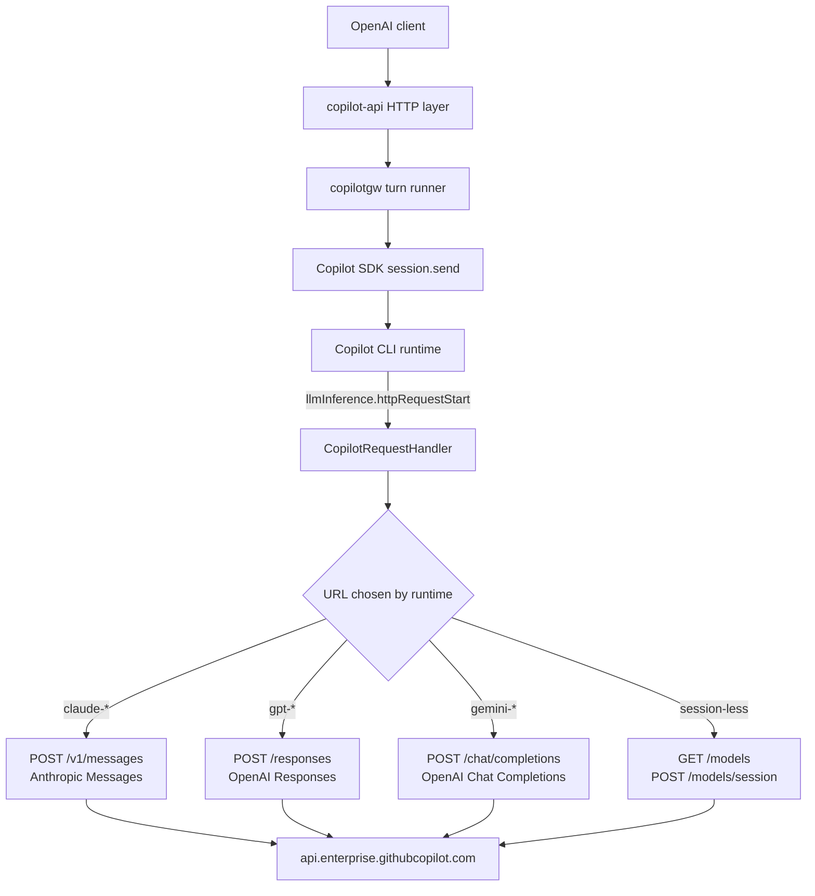

# Spike: CopilotRequestHandler as an injection seam

Date: 2026-07-26

Issue: [#4](https://github.com/evanlouie/copilot-api/issues/4)

## Verdict

**Qualified go, drastically narrower than the hypothesis.**

The hypothesis was "one seam fixes four limitations because the intercepted
payload is OpenAI-shaped". That is **false**. There is no single payload shape:
the runtime speaks a **different provider-native wire dialect per model
family**, and the four limitations are reachable in different — sometimes zero —
ways in each.

What is actually true, and was proven end to end on a live account:

- Injecting `text.format` with a `json_schema` into the **OpenAI Responses**
  dialect (`gpt-*`) **works**. A prompt that would normally return prose
  returned `{"age":36,"name":"Ada Lovelace"}` through the proxy's own Chat
  Completions path.
- The same injection into the **OpenAI Chat Completions** dialect (`gemini-*`)
  was **accepted with HTTP 200 and silently ignored**. The model returned prose.
  This is the worst possible failure mode: we would advertise a capability that
  quietly does not work.
- The **Anthropic Messages** dialect (`claude-*`, and whatever the default
  `auto` router picks) has **no `response_format` / `json_schema` field at
  all**. There is nothing to inject.

So: pursue **structured outputs**, gated per dialect, default-off, and keep
returning the existing hard `400` for model families where it cannot be
enforced. Do **not** treat this seam as a general-purpose control plane, and do
not take on `tool_choice`, `parallel_tool_calls` or `max_tokens` in the same
change.

See [Recommendation](#recommendation) for the staging, and [Risks](#risks) for
the two findings that should gate any merge — an experimental RPC surface, and
an observed unbounded hang when an injected request is rejected upstream.

## What I did

Static analysis of the SDK, then four live probes against a real Copilot
subscription.

The probe is a throwaway test harness at
`internal/copilotgw/spike_request_handler_probe_test.go`. It builds a real
`RealGateway`, then **replaces that gateway's SDK client** with one that has a
`copilot.CopilotRequestHandler` installed:

```go
transport := newSpikeCapturingTransport()
transport.mutate = mutate
opts := newRealClientOptions(cfg)
opts.RequestHandler = &copilot.CopilotRequestHandler{Transport: transport}
gw.client = copilot.NewClient(opts)
```

Production code is untouched. `newRealClientOptions` still returns a
handler-free config, so nothing in the shipped request path changes.

The custom `http.RoundTripper`:

- mirrors the SDK's own default transport (`DisableCompression = true`, see
  `copilot_request_handler.go:44`);
- reads and records the request body, optionally rewrites it, then replays it;
- wraps the **response** body in a tee rather than buffering it, so streaming is
  preserved and the capture is a side effect;
- redacts credential headers **and** credential-bearing JSON body fields before
  anything is written to disk.

### Reproducing

All probes skip unless `COPILOT_API_LIVE_TESTS=1`, per the convention in
`internal/copilotgw/live_test.go`.

```sh
# Pass-through capture (question 1, 3, 5, 6)
COPILOT_API_LIVE_TESTS=1 \
COPILOT_CLI_PATH=/path/to/copilot \
COPILOT_API_LIVE_MODEL=gpt-5.5 \
COPILOT_API_SPIKE_CAPTURE_DIR=/tmp/spike \
  go test ./internal/copilotgw/ -run TestSpikeCopilotRequestHandlerCapture -v

# Structured-output injection (question 2)
COPILOT_API_LIVE_TESTS=1 \
COPILOT_CLI_PATH=/path/to/copilot \
COPILOT_API_LIVE_MODEL=gpt-5.5 \
  go test ./internal/copilotgw/ \
  -run TestSpikeCopilotRequestHandlerStructuredOutputInjection -v

# Hot-path failure mode. Opt-in twice, because it does not terminate.
COPILOT_API_LIVE_TESTS=1 COPILOT_API_SPIKE_BAD_INJECTION=1 \
COPILOT_CLI_PATH=/path/to/copilot \
  go test ./internal/copilotgw/ \
  -run TestSpikeCopilotRequestHandlerBadInjection -v -timeout 120s

# Control: same class of upstream failure with no handler installed
COPILOT_API_LIVE_TESTS=1 \
COPILOT_CLI_PATH=/path/to/copilot \
  go test ./internal/copilotgw/ \
  -run TestSpikeUpstreamErrorWithoutInterception -v -timeout 120s
```

Environment for every result below:

- Copilot Go SDK `v1.0.6`, Copilot CLI `1.0.75`, protocol `3`
- Host `api.enterprise.githubcopilot.com`
- Auth: the CLI's own logged-in user (`GITHUB_TOKEN` unset)
- macOS, Go 1.26.5

Capture artifacts were written to `/tmp` and are **not** committed; the excerpts
in this document are copied by hand and re-checked for secrets.

## Where the seam sits



The important structural point: the handler is registered **process-wide**, not
per session. `client.go:399` calls `RPC.LlmInference.SetProvider` once on
connect, and from then on _all_ model-layer traffic — including the model
catalog and the call that mints a session token — is routed through our code.

## Answers

### 1. Is the body an OpenAI `/chat/completions` payload, or a proprietary envelope? — **Observed**

**Neither.** It is the _provider-native_ API of whichever model family the
runtime resolved, sent to a GitHub-hosted endpoint, with GitHub-proprietary
extensions mixed in.

| Model requested                             | URL                      | Dialect                 |
| ------------------------------------------- | ------------------------ | ----------------------- |
| `claude-haiku-4.5` (also what `auto` chose) | `POST /v1/messages`      | Anthropic Messages      |
| `gpt-5.5`, `gpt-5-mini`                     | `POST /responses`        | OpenAI Responses        |
| `gemini-3.6-flash`                          | `POST /chat/completions` | OpenAI Chat Completions |

It is not a runtime envelope — there is no wrapper around a provider payload,
these are the real upstream request bodies, and the `X-Stainless-Helper-Method`
header on the Anthropic path shows the CLI is driving a stock Anthropic SDK
client.

Proprietary extensions observed in these "standard" payloads:

- `snippy: {enabled: false}` in the Chat Completions request;
- `copilot_usage` with nano-AIU billing detail in the Chat Completions response;
- `reasoning_opaque` (an encrypted blob) in the Chat Completions response;
- `thinking: {type, budget_tokens, display: "summarized"}` in the Anthropic
  request — `display` is not part of the public Anthropic API.

This single finding invalidates the issue's premise. There is no one payload to
mutate.

### 2. Does the runtime re-parse responses in a way injection would break? — **Observed for structured outputs; open for tool controls**

**Observed:** it does not break, for the case that matters most.

Injecting into the `/responses` dialect:

```go
text["format"] = map[string]any{
    "type": "json_schema", "name": "person", "strict": true,
    "schema": spikePersonSchema(),
}
payload["text"] = text
payload["max_output_tokens"] = 2048
```

Result on `gpt-5.5`, verbatim from the probe:

```text
turn text: "{\"age\":36,\"name\":\"Ada Lovelace\"}"
capture ... mutated=true status=200 POST .../responses
RESULT: structured output enforced end to end: name="Ada Lovelace" age=36
```

Upstream accepted it, the runtime parsed the (still perfectly normal) response,
the turn completed, and the gateway returned the JSON as assistant content. The
merge also had to preserve `text.verbosity`, which the runtime sets itself — a
naive assignment to `text` would have clobbered it. That is a small preview of
the coupling cost.

`max_output_tokens` rode along in the same injection without complaint, so
question 4's `max_tokens` limitation is technically solvable here too.

**Open:** I did not test `tool_choice` or `parallel_tool_calls`, so I have no
evidence about the runtime's tool-call reconciliation. Note that `tool_choice`
is the one control that _exists_ in all three dialects (Anthropic has
`tool_choice: {type: "any" | "tool"}`), which makes it the natural second target
— but see the silent-ignore result below before assuming it works.

### 3. How are streaming bodies framed, can they pass through untouched? — **Observed**

**Yes, and the pass-through must be a tee, not a buffer.**

Observed framing:

- Anthropic path: `Content-Type: text/event-stream`, `stream: true` in the
  request, standard Anthropic SSE (`event: message_start`, `content_block_delta`
  with `thinking_delta`, etc.), ~17 KB for a short turn.
- OpenAI Responses path: for a non-streaming proxy request the runtime issued a
  **non-streaming** request and got a single JSON body back.
- Chat Completions path: single JSON body.

So the runtime decides streaming per dialect, independently of whether the proxy
client asked for a stream.

The SDK forwards the response by reading 32 KiB at a time and pushing each chunk
to the runtime (`streamResponseToSink`, `copilot_request_handler.go:218`). My
tee wrapper preserved this exactly: the turn completed normally while a copy
accumulated. A custom RoundTripper that does `io.ReadAll(resp.Body)` would
convert every streaming turn into a buffered one.

Two inherited constraints, both **observed in source**, that a production
transport must respect:

- `DisableCompression = true` on the SDK's default transport. Forget it and you
  silently change framing.
- `RoundTrip` is called directly, so **redirects are not followed**.

**Inferred, untested:** `streamResponseToSink` does `string(buf[:n])` on an
arbitrary 32 KiB boundary and sends it as JSON-RPC text. A multi-byte UTF-8 rune
straddling that boundary looks corruptible. This is the SDK's own default path,
so it applies whenever `RequestHandler` is set at all, not just when we mutate.

### 4. Is the shape stable enough to depend on? — **Observed, and the answer is no**

Three independent signals, all observed:

1. **The RPC surface declares itself experimental.** Every generated type is
   annotated: _"Experimental: LlmInferenceHTTPRequestStartRequest is part of an
   experimental API and may change or be removed."_ (`rpc/zrpc.go`). That
   applies to the whole `LlmInference*` family and to `ServerLlmInferenceAPI`.
2. **It is undocumented.** `RequestHandler` appears **zero times** in the SDK's
   39 KB `README.md`. The only documentation is the doc comment on the struct.
3. **The payloads are not the SDK's API at all.** They are the GitHub Copilot
   service's upstream wire formats. They carry no version we can pin, and the
   dialect is chosen server-influenced at request time.

**Inferred:** maintenance cost is therefore _two_ independent streams — SDK
upgrades (which may remove the seam outright, as the experimental annotation
warns) and silent service-side changes (which we cannot observe). The
`gemini-3.6-flash` result is the proof that the second stream is real and
dangerous: the service accepted an injected `response_format` with a 200 and
ignored it. A service change of exactly that shape would turn a working feature
into a silently broken one with no error anywhere.

### 5. Can `SessionID` correlate an intercepted call to the proxy request? — **Observed for Chat; inferred for Responses**

**Observed:** yes for Chat Completions, and better than expected — the
`SessionID` is the gateway's _own_ minted session id:

```text
capture transport=http session="chat_a5ce6535-b215-487a-b5db-fd477d0faf8a" ...
```

Because the Chat path creates a session per proxy request, that is a 1:1
mapping. `copilot.RequestContextFrom(req)` is the documented way to read it from
inside a RoundTripper, and it worked.

**Observed:** `SessionID` is **empty** for `GET /models`, `POST /models/session`
and `POST /models/session/intent`, exactly as the RPC docs say ("Absent for
requests issued outside any session"). So an injecting transport must not assume
it is present, and must scope mutation by URL, not just by session.

**Inferred (from `warm_response.go`, not observed live):** the Responses path
reuses one `resp_sdk_<uuid>` session across many proxy requests via warm
sessions and resume. There the mapping is 1:N and `SessionID` alone **cannot**
identify which proxy request an intercepted call belongs to.

**Observed in source, worth flagging:** the RPC envelope carries `agentId`,
`parentAgentId` and `interactionType`, and the SDK adapter **drops all three**
when building `CopilotRequestContext` (`copilot_request_handler.go:582`). On the
CAPI transport they are partly recoverable from headers — captures showed
`X-Interaction-Type: conversation-user`, `Openai-Intent: conversation-agent`,
`X-Initiator: user`, `X-Agent-Task-Id` — but that means depending on header
names instead of a typed field.

### 6. Does interception interact badly with auth/token handling? — **Observed**

**It does not break auth, but it makes us a credential-handling component.**

The runtime performs the entire token dance itself and hands the handler an
already-authorized request; the SDK forwards headers verbatim minus hop-by-hop
(`buildHTTPRequest`). Every probe authenticated fine.

The problems are exposure, not breakage:

- `Authorization` and `Copilot-Session-Token` pass through our process in
  cleartext on every inference call.
- **`POST /models/session` is itself routed through the handler**, and its
  response body contains a `session_token` JWT. We sit on the credential-minting
  path, not merely the inference path.

My first redactor only handled headers and would have written that JWT to disk.
Body-level redaction had to be added (`spikeBodySecretPattern` in the probe).
Any production use of this seam that logs anything must treat both directions as
secret-bearing.

## Redacted capture

Pass-through capture, `gpt-5.5`, from a proxy request whose only content was
`Reply with OK only.`

**Request**

```text
POST https://api.enterprise.githubcopilot.com/responses
Authorization: [REDACTED]
Accept: application/json
Content-Type: application/json
Copilot-Integration-Id: copilot-developer-cli
Editor-Version: copilot/1.0.75
Openai-Intent: conversation-agent
X-Github-Api-Version: 2026-07-01
X-Initiator: user
X-Interaction-Type: conversation-user
X-Agent-Task-Id: [REDACTED]
X-Client-Machine-Id: [REDACTED]
X-Client-Session-Id: [REDACTED]
X-Interaction-Id: [REDACTED]
```

```json
{
  "model": "gpt-5.5",
  "instructions": " ",
  "input": [
    {
      "role": "user",
      "content": [
        {
          "type": "input_text",
          "text": "<current_datetime>2026-07-26T15:18:24.328-07:00</current_datetime>\n\nReply with OK only."
        }
      ],
      "type": "message"
    }
  ],
  "tools": [],
  "reasoning": { "effort": "medium" },
  "text": { "verbosity": "low" },
  "store": false,
  "include": ["reasoning.encrypted_content"]
}
```

**Response** (HTTP 200, `application/json`, abridged)

```json
{
  "object": "response",
  "status": "completed",
  "model": "gpt-5.5",
  "output": [
    { "type": "reasoning", "summary": [] },
    {
      "type": "message",
      "role": "assistant",
      "content": [{ "type": "output_text", "text": "OK" }]
    }
  ],
  "usage": {
    "input_tokens": 42,
    "output_tokens": 17,
    "output_tokens_details": { "reasoning_tokens": 10 },
    "total_tokens": 59
  },
  "copilot_usage": {
    "total_nano_aiu": 72000000,
    "token_details": ["[abridged]"]
  }
}
```

For contrast, the same proxy request routed to `claude-haiku-4.5`:

```json
{
  "model": "claude-haiku-4.5",
  "max_tokens": 8192,
  "system": [],
  "messages": [
    {
      "role": "user",
      "content": [
        {
          "type": "text",
          "text": "<current_datetime>...</current_datetime>\n\nReply with OK only.",
          "cache_control": { "type": "ephemeral" }
        }
      ]
    }
  ],
  "temperature": 1,
  "thinking": {
    "type": "enabled",
    "budget_tokens": 1024,
    "display": "summarized"
  },
  "stream": true
}
```

Nothing in that payload can express a JSON schema.

## Risks

### Undocumented, experimental coupling

Covered in answer 4. The seam is annotated experimental in generated code and
absent from the SDK README, and the payloads are upstream service formats with
no pinnable version. **A silent service-side change is a realistic failure mode,
and the `gemini` silent-ignore result shows what it looks like: HTTP 200 and a
capability that stopped working.**

Mitigation, if this proceeds: never trust injection to have taken effect —
validate the _response_ against the schema and fail loudly when it does not
match, rather than assuming enforcement.

### Hot path, with an observed unbounded hang

Installing `RequestHandler` puts our code on **every** model-layer request for
**every** user, including the model catalog and session-token minting.

The failure mode is not theoretical. With a deliberately corrupted body
(`temperature: "definitely-not-a-number"`):

```text
turn error: Execution failed: CAPIError: 400 failed to parse request
capture ... mutated=true status=400 POST .../responses
```

The error surfaced cleanly to the caller — but **the gateway's `Stop()` then
never returned.** Reproduced three times; killed at 75 s, 120 s and 600 s.

The control matters here. Without any handler installed, an upstream 400
provoked by an oversized prompt behaved fine:

```text
RESULT: handler-free oversized turn err=... 400 prompt token count of 800031 exceeds the limit of 128000
RESULT: Stop took 10.782659125s err=timed out waiting for CLI process to exit after kill
```

And a _successful_ intercepted turn also shut down in ~10.4 s. So the hang needs
both interception and an upstream rejection.

**Honest caveat:** the two error paths are not identical — the handler-free
failure was retried five times by the runtime and reported as a model error,
while the injected failure came back as `CAPIError: 400 failed to parse request`
with no retry. The hang may be a property of that _error class_ rather than of
interception itself. I did not isolate it further. Either way, it is an
unexplained way to wedge the process that only appears once the seam is in use,
and it should be understood before any merge.

`TestSpikeCopilotRequestHandlerBadInjection` is gated behind a second env var
(`COPILOT_API_SPIKE_BAD_INJECTION=1`) precisely because running it wedges the
package.

### Scope creep

The `text.verbosity` merge is the canary: correct injection already requires
knowing what the runtime puts in the payload and preserving it. Each additional
control multiplies that by three dialects. The temptation to re-implement
runtime behaviour is real and should be resisted by keeping the injected surface
tiny.

## Recommendation

**Go, but only for structured outputs, only where it is enforceable, and
default-off.**

Rationale for that ordering, against the issue's four candidates:

| Limitation            | Verdict from this spike                                                                                                                                                      |
| --------------------- | ---------------------------------------------------------------------------------------------------------------------------------------------------------------------------- |
| Structured outputs    | **First.** Only currently _rejected_ capability, so the upside is a hard 400 becoming a working feature. Proven end to end on `gpt-*`.                                       |
| `tool_choice`         | **Second, pending evidence.** The only control present in all three dialects. But untested, and the `gemini` result means "the field exists" is not evidence it is honoured. |
| `max_tokens`          | Technically easy (all three dialects have a field; it rode along in the probe). Low value — defer.                                                                           |
| `parallel_tool_calls` | **Last.** Absent from the Anthropic dialect; the 2026-05 spike found it hard-coded on the other paths. Least tractable, least valuable.                                      |

Suggested staging for a follow-up:

1. **Default-off feature flag.** No user gets interception until explicitly
   enabled. This is a prerequisite, not a nicety, given the hang above.
2. **Dialect-gated enforcement.** Inject only on `/responses`. Keep returning
   the existing `400` for `json_schema` on every other model family — do **not**
   accept-and-ignore. A capability map keyed by model family, derived from the
   URL observed at intercept time, is the smallest thing that works.
3. **Verify, don't assume.** Validate the assistant output against the requested
   schema and surface a real error if it does not conform, so a silent
   service-side regression fails loudly.
4. **Resolve the hang** (or bound it with a timeout) before the flag is
   considered for default-on.
5. **Redaction discipline** on both headers and bodies for any logging added at
   this seam.

If step 4 cannot be resolved, the recommendation flips to **no-go**: a proxy
that can wedge on an upstream 400 is worse than a proxy that returns 400 for
`json_schema`.

## Notes for whoever picks this up

- The probe file is throwaway. Delete it, or rewrite it properly, rather than
  promoting it.
- `internal/copilotgw` has a `goleak` `TestMain`. **Live** runs in that package
  already fail it, with or without a request handler — the leaked goroutines are
  `os/exec.(*Cmd).Start` and `copilot-sdk.(*Client).monitorProcess`, both
  SDK-owned. Verified against the pre-existing
  `TestLiveCopilotReasoningStreamsBeforeContent`, which fails goleak identically
  and has no handler installed. A custom transport does add its own leak (HTTP/2
  read loops) unless you call `CloseIdleConnections`; the probe does.
- `internal/copilotgw/live_test.go` hardcodes `gpt-5`, which is no longer in the
  catalog, so `TestLiveCopilotTextCompletion` currently fails with
  `model not found: gpt-5`. Out of scope here, but worth a separate issue.
- The 2026-05 spike `tool-choice-enforcement.md` captured a **BYOK** provider
  request and saw OpenAI Chat Completions with `parallel_tool_calls: false`.
  This spike captured the **CAPI** path and saw three dialects and no
  `parallel_tool_calls` at all. Both are correct; they are different transports.
  Do not carry conclusions across.

## Validation

- `make go-ci` — passes (fmt-check, build, vet, `go test ./... -race -count=1`,
  staticcheck).
- All live probes skip by default; the non-live unit tests covering redaction,
  the streaming tee, and the per-dialect injection logic run in the normal
  suite.
